# Implantar e gerenciar as capacidades do Power BI Premium

**Resumo:** O Power BI Premium fornece desempenho mais consistente, suporte para grandes volumes de dados e a flexibilidade de uma plataforma unificada de BI de autoatendimento e do enterprise para todos em sua organização. Este white paper técnico de nível 300 foi escrito especificamente para administradores do Power BI e os autores de conteúdo e editores. Tem como objetivo ajudá-los a compreender o potencial do Power BI Premium e explicam como criar, implantar, monitorar e solucionar problemas de soluções escalonáveis.

**Autor:** [Os Peter Myers](https://www.linkedin.com/in/peterjsmyers) (MVP de plataforma de dados e independente especialista de BI com soluções de bit a bit)

**Revisores técnicos:** ADAM Saxton, Akshai Mirchandani, Bhavik comerciante, David Magar, Josh Caplan, Michael Blythe, Nimrod Shalit, Olivier Matrat, Gupta Swati

**Aplica-se a:** Serviço do Power BI, Power BI Premium e as capacidades do Azure Power BI Embedded

> [!NOTE]
> Você pode salvar ou imprimir este whitepaper selecionando **Imprimir** no seu navegador e, em seguida, selecionando **Salvar como PDF**.

## Apresentando o Power BI

Power BI é um serviço de análise de negócios projetado para oferecer informações que permitem que as decisões rápidas e informadas. Desde seu lançamento em 2015 ele se tornou rapidamente um serviço popular usado para entregar soluções para a menor das organizações para a maior das empresas.

Ele é disponibilizado de duas maneiras: Solução de relatório denominado como um serviço de nuvem e locais **Power BI Report Server**. \[[1](#endnote-01)\]

Power BI como um serviço de nuvem estiver Software-como um serviço (SaaS) \[ [2](#endnote-02)\]. Ele representa um conjunto de serviços e aplicativos que permitem que as organizações ao desenvolver, implantar, gerenciar e compartilhar soluções para monitorar seus negócios.

Não é a intenção deste white paper para fornecer uma descrição abrangente de serviço do Power BI. Em vez disso, ele aborda tópicos relevantes para o assunto do Power BI Premium. Para obter informações gerais sobre o Power BI, consulte o abrangente [documentação do Power BI](service-admin-premium-multi-geo.md). Para obter uma explicação mais detalhada do serviço do Power BI com um foco na obtenção de implantações de bom desempenho corporativo, consulte a abrangente [Planejando uma implantação do Power BI Enterprise](https://aka.ms/pbienterprisedeploy) white paper.

Dentro do contexto do assunto neste white paper, esta seção apresenta e descreve as capacidades, Power BI tipos de conteúdo, modos de armazenamento de modelo e licenciamento. Uma compreensão desses tópicos é essencial para implantar e gerenciar o Power BI Premium com êxito.

### Capacidades

**As capacidades** é um conceito do Power BI core que representa um conjunto de recursos (armazenamento, processador e memória) usados para hospedar e entregar o Power BI conteúdo. As capacidades são compartilhadas ou dedicadas. Um **capacidade compartilhada** é compartilhado com outros clientes da Microsoft, enquanto um **capacidade dedicada** está totalmente comprometida com um único cliente. As capacidades de dedicados são introduzidas na [capacidades Premium](#premium-capacities) tópico.

Na capacidade compartilhada, cargas de trabalho executadas em recursos computacionais compartilhados com outros clientes. Como a capacidade deverá compartilhar recursos, limitações são impostas para garantir que o "fair reproduzir", como o tamanho máximo de modelo (1 GB) e a frequência de atualização diária máxima (oito vezes por dia).

### Workspaces

Espaços de trabalho do Power BI residem dentro de capacidades e representam contêineres de colaboração, segurança e a implantação. Cada usuário do Power BI tem um espaço de trabalho pessoal, conhecido como **meu espaço de trabalho**. Espaços de trabalho adicionais podem ser criados para habilitar a colaboração e a implantação, e eles são conhecidos como **espaços de trabalho do aplicativo**. Por padrão, os espaços de trabalho - incluindo espaços de trabalho pessoas - são criados na capacidade compartilhada.

### Tipos de conteúdo de BI de energia

Para apresentar os tópicos do Power BI Premium, é importante iniciar com uma discussão completa de arquitetura do Power BI, incluindo tipos fundamentais do conteúdo.

Todo o conteúdo do Power BI é armazenado e gerenciado em espaços de trabalho que são contêineres para o conteúdo do Power BI. Cada usuário do Power BI tem seu próprio espaço de trabalho, mas a prática recomendada geral é criar espaços de trabalho do aplicativo. Espaços de trabalho de aplicativo permitem co-ownership de conteúdo e a capacidade de colaborar no conteúdo. Eles também fornecem a capacidade de preparar e distribuir conteúdo a um grande público, como aplicativos.

O seguinte conteúdo do Power BI é armazenado em espaços de trabalho:

- Fluxos de dados
- Conjuntos de dados
- Pastas de trabalho
- Relatórios
- Dashboards

#### Fluxos de dados

Fluxos de dados do Power BI ajudam as organizações a unificar dados de origens distintas. Eles podem ser considerados como dados preparados e preparado para uso em modelos, no entanto, eles não podem ser usados diretamente como fonte para relatórios. Eles usam o amplo conjunto de conectores de dados da Microsoft, permitindo a ingestão de dados de fontes de dados baseado em nuvem e locais.

Fluxos de dados só podem ser criados e gerenciados em espaços de trabalho do aplicativo, e eles são armazenados como entidades no modelo de dados comuns (CDM) no armazenamento do Azure Data Lake Gen2. Normalmente, eles são agendados para atualizar de forma recorrente para armazenar os dados atualizados.

Para obter mais informações, consulte o [preparação de dados de autoatendimento no Power BI (visualização)](service-dataflows-overview.md) documento.

#### Conjuntos de dados

Conjuntos de dados do Power BI representam uma fonte de dados prontos para o relatório e visualização. Há muitos tipos de conjuntos de dados criados por:

- Conectar-se a um modelo de dados existente que não está hospedado em uma capacidade do Power BI
- Carregar um arquivo do Power BI Desktop que contém um modelo
- Carregar uma pasta de trabalho do Excel (que contém uma ou mais tabelas do Excel e/ou em um modelo de dados da pasta de trabalho) ou carregar um arquivo de valor separado por vírgulas (CSV)
- Usando o serviço do Power BI para criar um envio por push, streaming ou híbrida ao conjunto de dados de streaming

Exceto para conjuntos de dados de streaming \[ [3](#endnote-03)\], o conjunto de dados representa um modelo de dados que aproveita as tecnologias de modelagem maduro do Analysis Services.

Observe que na documentação, às vezes, os conjuntos de dados de terminologias e os modelos são intercambiáveis. Em geral, de uma perspectiva de serviço do Power BI-lo é conhecido como um **dataset** e de uma perspectiva de desenvolvimento, ele é conhecido como um **modelo**. No contexto deste white paper que significam a mesma coisa.

##### Modelos hospedados externamente

Conectando a um modelo hospedado externamente, será necessário instalar o [Gateway de dados locais](service-gateway-onprem.md) para se conectar ao SQL Server Analysis Services, seja ele local ou hospedado em VM infraestrutura-como um serviço (IaaS). O Azure Analysis Services não requer um gateway. Neste cenário geralmente faz sentido quando existem os investimentos existentes do modelo, normalmente que formam parte do Enterprise Data Warehouse (EDW). Ele permite que o Power BI para executar uma **Conexão ao vivo** (LC) com o Analysis Services e faz isso aplicando permissões de dados usando a identidade do usuário de relatório do Power BI. Para SQL Server Analysis Services, modelos multidimensionais (cubos) e modelos de tabela têm suporte. Conforme mostrado na imagem a seguir, um conjunto de dados de Conexão ao vivo passa consultas para modelos hospedados externamente.

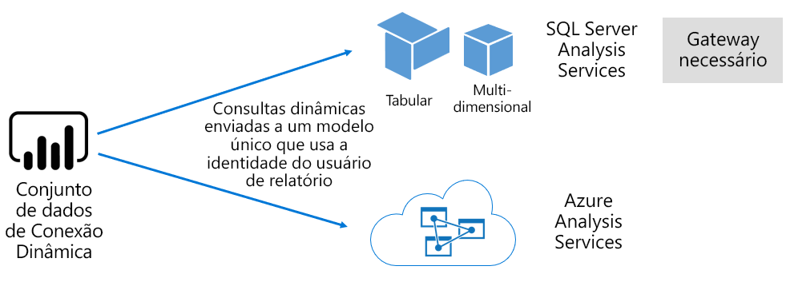

##### Modelos desenvolvidos para área de trabalho do Power BI

Power BI Desktop – um aplicativo cliente destinado para desenvolvimento do Power BI - pode ser usado para desenvolver um modelo que é efetivamente um modelo tabular do Analysis Services. Modelos podem ser desenvolvidos com a importação de fluxos de dados, que, em seguida, podem ser integrados a outras fontes de dados. Enquanto as informações específicas sobre como a modelagem pode ser obtida está fora do escopo deste white paper, é importante entender que há três diferentes tipos de - ou modos de - de modelos que podem ser desenvolvidos usando o Power BI Desktop. Esses modos de determinam se os dados são importados para o modelo, ou se ele permanece na fonte de dados. Os três modos são: Import, DirectQuery e composto. Uma discussão completa sobre cada modo será abordada os [modos de armazenamento de modelo](#model-storage-modes) tópico.

Modelos hospedados externamente e modelos desenvolvidos no Power BI desktop podem impor a segurança de nível de linha (RLS) para limitar os dados que podem ser recuperados para um determinado usuário. Por exemplo, os usuários atribuídos ao grupo de segurança de vendedores só podem exibir dados de relatório para as regiões de vendas à qual são atribuídos. Funções RLS podem ser dinâmico ou estático. **Funções dinâmicas** filtro pelo usuário do relatório, enquanto **funções estáticas** aplicará os mesmo filtros para todos os usuários atribuídos à função.

##### Modelos de pasta de trabalho do Excel

Criando conjuntos de dados com base em pastas de trabalho do Excel ou CSV arquivos resultará na criação automática de um modelo. Tabelas do Excel e os dados CSV serão importados para criar tabelas de modelo, enquanto um modelo de dados de pasta de trabalho do Excel será ser modificado para criar um modelo do Power BI. Em todos os casos, os dados de arquivo são importados para um modelo.

Distinções, em seguida, podem ser feitas sobre conjuntos de dados do Power BI que representam modelos:

- Eles esteja hospedados no serviço do Power BI ou externamente são hospedados pelo Analysis Services
- Eles podem armazenar dados importados ou que possam emitir solicitações de consulta de passagem para fontes de dados subjacentes, ou uma mistura de ambos

Aqui está um resumo dos fatos importantes sobre conjuntos de dados do Power BI que representam modelos:

- Modelos do SQL Server Analysis Services hospedada exigem um gateway para executar consultas de LC
- Modelos de Power BI hospedados que importam dados
  - Deve ser totalmente carregado na memória para que eles podem ser consultados
  - Exigir a atualização para manter os dados atuais e deve envolver gateways quando dados de origem não estão acessíveis diretamente pela Internet
- Modelos de Power BI hospedados que usam o modo de armazenamento DirectQuery (DQ) exigem conectividade com a fonte de dados. Quando o modelo é consultado, o Power BI emite consultas para dados de origem para recuperar os dados atuais. Esse modo deve envolver gateways quando dados de origem não estão acessíveis diretamente pela Internet.
- Modelos podem impor regras RLS, aplicando filtros para limitar o acesso a dados para determinados usuários

Para implantar e gerenciar o Power BI Premium com êxito, é importante entender onde os modelos são hospedados, o modo de armazenamento, todas as dependências em gateways, o tamanho dos dados importados e o tipo e a frequência de atualização. Eles podem ter um impacto significativo nos recursos do Power BI Premium. Além disso, o design de modelo em si, incluindo seus cálculos e consultas de preparação de dados pode adicionar à combinação de considerações.

Também é importante entender que hospedado pelo Power BI importar modelos podem ser de acordo com a agenda de atualização ou ser disparados sob demanda por um usuário no serviço do Power BI.

Projetar modelos otimizados é discutida posteriormente neste artigo técnico na [otimizando modelos](#optimizing-models) tópico.

#### Pastas de trabalho

Pastas de trabalho do Power BI são um tipo de conteúdo do Power BI \[ [4](#endnote-04)\]. Eles são pastas de trabalho do Excel que foram carregadas no serviço do Power BI e não devem ser confundido com pastas de trabalho do Excel carregadas que cria conjuntos de dados (modelos). O tipo de conteúdo da pasta de trabalho representa uma conexão para uma pasta de trabalho, que também pôde ser carregada para o serviço do Power BI ou mantido no armazenamento em nuvem no OneDrive ou SharePoint Online.

É importante compreender que esse tipo de conteúdo não está disponível como uma fonte de dados para visualizações de dados do Power BI. Em vez disso, ele pode ser aberto como uma pasta de trabalho no serviço do Power BI usando o Excel Online. A principal intenção desse tipo de conteúdo é permitir que os relatórios de pasta de trabalho do Excel herdados para ser acessível de dentro do serviço do Power BI e para permitir que suas visualizações de dados ser fixados em painéis do Power BI.

Para obter mais informações, consulte o [obter dados de arquivos de pasta de trabalho do Excel](service-excel-workbook-files.md) documento.

#### Relatórios

Há dois tipos de relatórios: Relatórios do Power BI e relatórios paginados.

**Relatórios do Power BI** fornecer experiências que se conecta a apenas um único conjunto de dados de uma visualização de dados interativa. Relatórios geralmente são criados para incentivar a participação do usuário, permitindo que eles interajam com uma matriz extraordinária de recursos, incluindo a filtragem, divisão, cross filtragem e realce, fazer o drill up, fazer uma busca detalhada, o detalhamento, perguntas e respostas um natural linguagem de questionamento, concentrando-se, navegação de página, evidenciando, exibindo indicadores e muito mais.

No contexto deste white paper, é importante entender como a arquitetura do Power BI, interações de usuário e design de relatório do Power BI podem impactar nos recursos de serviço do Power BI:

- Para carregar e interagir com relatórios baseados em modelos de importação, o modelo deve ser totalmente carregado na memória (seja hospedado no serviço do Power BI ou hospedados externamente)
- Cada relatório visual emite uma consulta para recuperar dados, consultando o modelo
- Em geral, as interações de segmentação e filtro envolvem consultando o modelo. Por exemplo, alterar uma seleção de segmentação de dados - por padrão – exigirá recarregando cada visual na página \[ [5](#endnote-05)\]
- Relatórios do Power BI não garantem a exibição de dados atual e podem exigir que o usuário atualizar o relatório para recarregar a página de relatório e os respectivos visuais
- Usuários podem interagir com o Q & um recurso de linguagem natural para fazer perguntas, fornecendo o design de relatório do Power BI permite que ele e o conjunto de dados representa um modelo de importação de dados hospedado pelo Power BI ou um conjunto de dados LC configurados para habilitar a p e r

**Relatórios paginados** permitindo a publicação e a renderização de relatórios do SQL Server Reporting Services (SSRS) (\*formato. RDL). Como seu nome sugere, relatórios paginados são usados quando os requisitos ditam a necessidade de impressão para um tamanho fixo de página, ou quando há listas de variáveis de dados que devem ser totalmente expandidas. Por exemplo, uma fatura projetada para renderização de várias páginas (em vez de rolagem em um visual) e impressão.

Opção de fornecer os dois tipos de relatório com suporte para autores de relatório, permitindo que ele selecione o tipo com base nos requisitos e uso pretendido. Em geral, os relatórios do Power BI são ideais para experiências interativas, permitindo que o usuário explorar e descobrir informações de dados, enquanto os relatórios paginados são mais adequados para layouts de página orientado por parâmetros.

Independentemente do tipo de relatório, é fundamental para o fornecimento de uma experiência de usuário confiável e de bom desempenho alcançar as atualizações de carga e os dados de relatório responsivo (quando os filtros ou parâmetros são alterados).

#### Dashboards

Painéis do Power BI destinam-se para fornecer experiências de monitoramento e são conceitualmente muito diferentes dos relatórios do Power BI. Painéis são projetados para exibição em um único painel de controle para expressar valores e visualizações de dados em blocos. Geralmente, os painéis oferecem menos experiências de interação de relatórios do Power BI, com alguns designs de painel esperando sem interação. Por exemplo, um painel autônomo apresentado em uma tela não sensível em uma sala de servidor. Outra diferença significativa é que os painéis podem estar presentes blocos só podem se basear em um único conjunto de dados de relatórios de dados de origem de vários conjuntos de dados, enquanto um Power BI.

É importante entender que um painel é projetado para carregar rapidamente e expressar os dados mais atuais (conhecidos no serviço do Power BI) em todos os tempos. Ela consegue isso armazenando em cache os resultados da consulta de bloco, e ele faz isso para cada painel. Na verdade, ele deve fazer isso para cada usuário que tem acesso a um painel baseado em modelos que impõem RLS dinâmica.

O serviço do Power BI atualiza automaticamente os caches de painel de consulta imediatamente após a atualização dos modelos de importação do Power BI hospedados. No caso de modelos LC e DQ, o proprietário de conjunto de dados tem um grau de controle sobre a frequência com que o serviço do Power BI atualiza o cache, que pode ser configurado como frequentemente, como a cada 15 minutos ou raramente uma vez por semana. Observe que a atualizações de cache de consulta LC primeiro consultar metadados de modelo para determinar se uma atualização de modelo tiver sido feita desde a última atualização do cache, e não continuará a atualizar o cache quando uma atualização não ocorreu desde então. Essa verificação não é possível para modelos DQ e, portanto, as atualizações de cache ocorrerá se a fonte de dados foi alterado ou não.

Cache de consulta do painel atualiza com base em DQ e modelos de LC podem afetar significativamente em recursos de serviço do Power BI e fontes de dados externas. Considere a possibilidade de um painel com blocos de 20, tudo com base em um modelo do Azure Analysis Services que impõe a RLS dinâmica que é atualizado a cada hora e que esse painel é compartilhado com 100 usuários. Se o conjunto de dados é configurado para ser atualizado a cada hora, isso resultaria em pelo menos 2000 (20 x 100) consultas LC. Isso pode colocar uma enorme carga no serviço do Power BI e fontes de dados externas, e ele também pode exceder os limites impostos nos recursos disponíveis. Recursos de capacidade e limites são descritos os [nós de capacidade](#capacity-nodes) tópico.

Os usuários podem interagir com um dashboard de várias maneiras, que exigem recursos de serviço do Power BI. Especificamente, eles podem:

- Dispare uma atualização de blocos de painéis, o que pode resultar em uma atualização sob demanda de todos os dados hospedados pelo Power BI importar modelos relacionados
- Entre em contato com a p e um recurso de linguagem natural para fazer perguntas (fornecendo o painel de design permite que ele e o conjunto de dados é um modelo de importação de dados hospedado pelo Power BI ou um conjunto de dados LC configurados para habilitar a p e R)
- Use o recurso de Insights rápidos para ter o Power BI descobrir informações sobre um conjunto de dados subjacente e responder com elementos visuais que exibem e descrevê-los (fornecendo a que o bloco se baseia em um conjunto de dados que é o modelo de importação de dados hospedado pelo Power BI)
- Configurar alertas em blocos de dashboard, exigir que o serviço do Power BI para comparar os limites para organizar valores - possivelmente com a maior frequência horária - a e notificar os usuários quando os limites são excedidos (fornecendo que o bloco exibe um único valor numérico e se baseia em um conjunto de dados que é o modelo de importação de dados hospedado pelo Power BI)

### Modos de armazenamento de modelo

Lembre-se de que o Power BI Desktop permite desenvolver um modelo em um dos três modos. É importante entender a lógica para cada modo de armazenamento de modelo de dados e os possíveis impactos nos recursos do serviço do Power BI. Esta seção apresenta todos os três modos. Isso serão discutido em mais detalhes posteriormente neste white paper no tópico otimizando modelos.

#### Modo de importação

Modo de importação é o modo mais comum usado para desenvolver modelos devido a um desempenho extremamente rápido associado à consulta, a flexibilidade de design disponível para os modeladores, na memória e o suporte para recursos de serviço específicos do Power BI (p e R, Quick Insights etc.). É o modo padrão ao criar uma nova solução do Power BI Desktop.

É importante entender que os dados importados sempre são armazenados para disco e deve ser totalmente carregado na memória a serem consultadas ou atualizadas. Uma vez na memória, modelos de importação alcançar os resultados da consulta incrivelmente rápido. Também é importante entender que não há nenhum conceito de um modelo de importação seja parcialmente carregado na memória.

Quando atualizada, os dados são compactados e otimizados e, em seguida, armazenados em disco pelo mecanismo de armazenamento VertiPaq. Quando carregado do disco na memória, é possível ver a compactação de 10 vezes e, portanto, é razoável esperar que 10 GB de dados de origem pode compactar a cerca de 1 GB de tamanho. Tamanho de armazenamento em disco pode ser feito uma redução de 20% na parte superior. \[[6](#endnote-06)\]

Flexibilidade de design pode ser obtida de três maneiras. Os modeladores de dados podem:

- Integre dados armazenando em cache os dados de várias fontes de dados – independentemente do tipo de fonte de dados e formato
- Aproveitar todo o conjunto de funções de linguagem de fórmula Power Query (chamadas informalmente de M) durante a criação de consultas de preparação de dados
- Aproveitar todo o conjunto de funções de expressões DAX (Data Analysis) ao aprimorar o modelo com lógica de negócios, obtido com colunas, tabelas calculadas e medidas calculadas

Conforme mostrado na imagem a seguir, um modelo de importação pode integrar dados de qualquer número de tipos de fonte de dados com suporte.

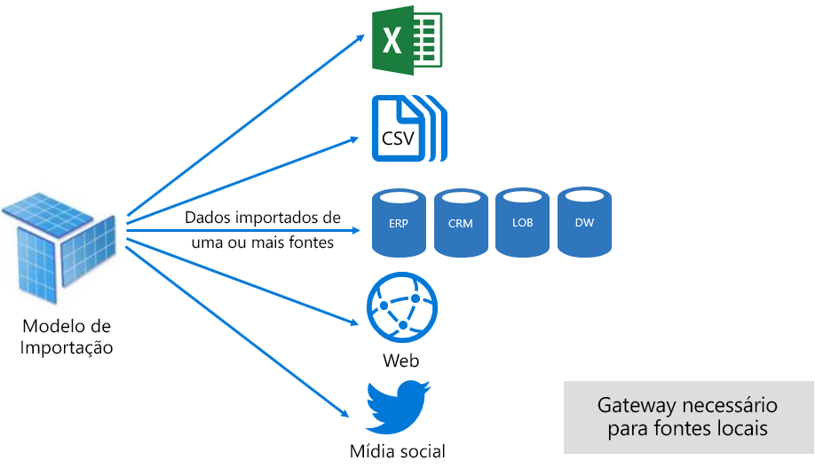

No entanto, embora haja vantagens atraentes associadas com modelos de importação, há desvantagens muito:

- Todo o modelo deve ser carregado na memória antes do Power BI pode consultar o modelo, que pode colocar a pressão nos recursos disponíveis à medida que aumentam o número e tamanho dos modelos
- Dados de modelo são apenas atuais como a atualização mais recente, e então importar modelos precisam ser atualizados, preferencialmente de forma programada
- Uma atualização completa removerá todos os dados de todas as tabelas e recarregá-lo da fonte de dados. Isso pode ser muito caro em termos de tempo e recursos para o serviço do Power BI e as fontes de dados. Power BI tem suporte para atualização incremental que pode evitar o truncamento e recarregadas tabelas inteiras, e isso é abordado na [Optimizing Power BI-Hosted modelos](#optimizing-power-bi-hosted-models) tópico.

De uma perspectiva de recurso do serviço do Power BI, modelos de importação exigem:

- Memória suficiente para carregar o modelo quando ele é consultado ou atualizado
- Recursos de processamento e recursos de memória adicional para atualizar dados

#### Modo DirectQuery

Modelos desenvolvidos no modo DirectQuery (DQ) não importar dados. Em vez disso, eles consistem apenas em metadados que, quando consultada consultas nativas de problemas com a fonte de dados subjacente.

Há dois motivos principais para considerar o desenvolvimento de um modelo DQ. O primeiro motivo é quando os volumes de dados são muito grandes - mesmo quando os métodos de redução de dados são aplicados - carregar em um modelo ou atualizar na prática. O segundo motivo é quando precisam de relatórios e painéis para entregar dados "quase em tempo real", além do que pode ser realizado dentro dos limites de atualização agendada (48 vezes por dia para uma capacidade dedicada).

Há várias vantagens associadas com modelos DQ:

- Limites de tamanho do modelo de importação não se aplicam
- Modelos não exigem a atualização
- Os usuários de relatório verão os dados mais recentes ao interagir com filtros de relatório e slicers e pode atualizar todo o relatório para recuperar os dados atuais
- Blocos de Dashboard, quando com base em modelos DQ, podem ser atualizada automaticamente com tanta frequência quanto a cada 15 minutos

No entanto, há várias desvantagens e as limitações associadas aos modelos DQ:

- O modelo deve ser baseado em uma fonte de dados com suporte e, portanto, qualquer integração de dados já deve ser obtida na fonte de dados. Fontes de dados com suporte são sistemas analíticos e relacionais, com suporte para vários armazenamentos de dados populares \[ [7](#endnote-07)\].
- O desempenho pode ser lento, possivelmente prejudicando no serviço do Power BI (consultas podem ser muito intensivo de CPU) e na fonte de dados (que não pode ser otimizado para consultas analíticas)
- Consultas do Power Query não podem ser excessivamente complexas e são limitadas a M expressões e funções que podem ser modificadas para consultas nativas compreendidas pela fonte de dados
- As funções DAX são limitadas àqueles que podem ser modificados para consultas nativas compreendidas pela fonte de dados, e não há suporte para tabelas calculadas ou recursos internos de inteligência de tempo
- Por padrão, haverá falha nas consultas de modelo que exigem a recuperação de mais de um milhão de linhas
- Relatórios e painéis com vários visuais podem exibir a resultados inconsistentes, especialmente quando a fonte de dados é volátil
- P e r e não há suporte para Insights rápidos

De uma perspectiva de recurso do serviço do Power BI, modelos DQ exigem:

- Um mínimo de memória para carregar o modelo (somente metadados) quando ele é consultado
- Recursos do processador significativa, às vezes, para gerar e processar as consultas enviadas à fonte de dados

Para obter mais informações, consulte o [Use a consulta direta no Power BI Desktop](desktop-use-directquery.md) documento.

#### Modo de composição

Modelos desenvolvidos no modo de composição permitem configurar o modo de armazenamento de tabelas de modelo individuais. Ele, portanto, dá suporte a uma combinação de importação e tabelas DQ. Ele também dá suporte a várias fontes de dados DQ e tabelas calculadas (definidas com o DAX).

Modo de armazenamento de tabela pode ser configurado como Import, DirectQuery ou duplo. Uma tabela configurada como modo de armazenamento duplo é de importação e DirectQuery, e isso permite que o serviço do Power BI determinar o modo mais eficiente usar em uma base de consulta por consulta.

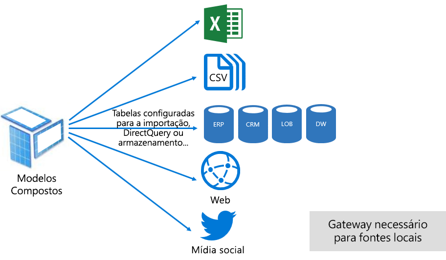

Modelos de composição se esforçar para entregar o melhor dos modos de importação e DirectQuery. Quando configurado adequadamente eles podem combinar o alto desempenho de consulta de modelos na memória com a capacidade de recuperar dados em tempo real de fontes de dados quase.

Modeladores de dados que desenvolvem modelos compostos têm probabilidade de configurar as tabelas do tipo de dimensão na importação ou Dual modo e o tipo de fato tabelas de armazenamento no modo DirectQuery. Por exemplo, considere um modelo com uma tabela de tipo de dimensão de produto em uma tabela de tipo de fatos de vendas no modo DirectQuery e de modo duplo. A tabela de produto pode ser consultada de forma eficiente e rápida de na memória para renderizar uma segmentação de dados do relatório. A tabela de vendas, em seguida, pode ser consultada no modo DirectQuery Unido à tabela de produtos relacionada. A segunda consulta poderia habilitar a geração de uma única consulta nativa eficiente para unir tabelas Product e vendas e filtrar pelos valores da segmentação de dados.

Em geral, as vantagens e desvantagens, associadas com cada modo de modelo podem ser consideradas para aplicar ao modo de armazenamento de tabela em modelos de composição.

Para obter mais informações, consulte o [usar modelos de composição no Power BI Desktop](desktop-composite-models.md) documento.

### Licenças

O Power BI tem três licenças:

- Power BI Gratuito
- Power BI Pro
- Power BI Premium

O **Power BI gratuito** licença permite que um indivíduo entrar no serviço do Power BI e trabalhar dentro do seu espaço de trabalho pela publicação de relatórios e modelos. É importante entender que não é possível compartilhar o conteúdo do Power BI usando essa licença. Esta licença, como o nome sugere, é gratuita.

O **Power BI Pro** licença permite que um indivíduo criar e colaborar em espaços de trabalho do aplicativo e compartilhar e distribuir o Power BI conteúdo. Eles também podem configurar a atualização para seus conjuntos de dados manter automaticamente dados atuais, inclusive de fontes de dados local. Além disso, eles podem auditar e controlar como os dados são acessados e usados. Essa licença é necessária para receber o conteúdo compartilhado de outras pessoas, a menos que o usuário está associado com uma capacidade dedicada do Power BI Premium.

O **Power BI Premium** licença é uma licença de nível de locatário e é discutida a [Introdução ao Power BI Premium](#introducing-power-bi-premium) seção.

Para obter mais informações sobre o licenciamento do Power BI, consulte o [preços do Power BI](https://powerbi.microsoft.com/pricing/) página.

## Introdução ao Power BI Premium

O Power BI Premium oferece uma plataforma unificada de BI de autoatendimento e a empresa com escala, desempenho confiável e custos previsíveis. Ele basicamente realiza isso fornecendo recursos dedicados para executar o serviço do Power BI para sua organização.

Além disso, o Power BI Premium oferece muitos recursos da empresa:

- Distribuição de conteúdo e econômica, permitindo o compartilhamento de conteúdo do Power BI para Power BI gratuito usuários ilimitados, incluindo usuários externos
- Suporte para tamanhos de conjunto de dados maiores \[ [8](#endnote-08)\]
- Taxas mais altas de atualização de fluxos de dados e conjuntos de dados (de até 48 vezes por dia)
- Atualização incremental dos fluxos de dados e conjuntos de dados
- Fluxo de dados vinculadas a entidades e a execução paralela de transformações
- Relatórios paginados
- Power BI Report Server, para relatórios locais
- Capacidade de inserir o conteúdo em aplicativos em nome dos usuários do aplicativo (PaaS)

Muitos desses recursos podem ser utilizados para fornecer soluções corporativas escalonáveis e eficientes e serão abordados os [otimizando as capacidades do Premium](#optimizing-premium-capacities) seção.

### Assinaturas e licenciamento

O Power BI Premium é uma assinatura do Office 365 de nível de locatário disponível em duas famílias SKU (Stock Keeping Unit):

- **EM** SKUs (EM1-EM3) para a inserção, que exigem um compromisso anual, cobrados mensalmente
- **P** SKUs (P1-P3) para inserir e recursos corporativos, exigindo um compromisso mensal ou anual, cobrado mensalmente e inclui uma licença para instalar o servidor de relatório do Power BI local

Uma abordagem alternativa é adquirir uma assinatura do Azure Power BI Embedded que tem uma única família SKU: **Um** SKUs (A1-A6) para inserir e capacidade somente para fins de teste.

Todos os SKUs de núcleos para criar as capacidades de entregar \[ [9](#endnote-09)\], mas os SKUs EM são restritos para a inserção de menor escala. Embora seja o foco deste white paper sobre os SKUs P, grande parte do que será discutido também é relevante também para os SKUs.

Em contraste com a assinatura Premium SKUs, SKUs do Azure não exigem nenhuma alocação de tempo e são cobradas por hora. Eles fornecem elasticidade completa habilitando a escala de backup, reduzir verticalmente, pausar, retomar e excluam.

Power BI Embedded do Azure é amplamente fora do escopo deste white paper, mas ele é discutido no tópico abordagens do teste como uma opção econômica e prática para testar e medir as cargas de trabalho.

Para obter mais informações sobre as SKUs do Azure, consulte a [documentação do Azure Power BI Embedded](/azure/power-bi-embedded/).

Power BI Premium são compradas pelos administradores no Centro de administração do Microsoft 365. Especificamente, apenas os administradores globais do Office 365 ou administradores de cobrança pode comprar SKUs.

Depois de adquiridas, o locatário recebe um número correspondente de núcleos para atribuir a capacidades - isso é conhecido como **pool de núcleos virtuais**. Por exemplo, comprar um SKU P3 fornece ao locatário 32 núcleos.

Para obter mais informações, consulte o [como comprar o Power BI Premium](service-admin-premium-purchase.md) documento.

### Capacidades Premium

Em contraste com uma capacidade compartilhada em que cargas de trabalho executadas em recursos computacionais compartilhados com outros clientes, uma **capacidade dedicada** é para uso exclusivo por uma organização. Ele é isolado com recursos computacionais dedicados que oferecem um desempenho confiável e consistente para o conteúdo hospedado.

É o foco deste white paper **capacidade Premium** , que significa que ele está associado com qualquer um dos SKUs P ou EME.

#### Nós de capacidade

Como descrito em assinaturas e licenciamento do tópico, há duas famílias de SKU do Power BI Premium: EM e P. Todas as SKUs do Power BI Premium estão disponíveis como nós de capacidade, com cada um representando uma quantidade definida de recursos compostos por processador, memória e armazenamento. Além de recursos, cada SKU tem limites operacionais no número de conexões do DirectQuery (DQ) e Conexão ao vivo (LC) por segundo e o número de modelo paralelo é atualizada.

Processamento é feito por um determinado número de núcleos, dividido igualmente entre o back-end e front-end.

**Núcleos de back-end** são responsáveis pela funcionalidade do Power BI core, incluindo processamento de consultas, gerenciamento de cache, execução de R services, a atualização do modelo, processamento de linguagem natural (Q & A) e renderização do lado do servidor de relatórios e imagens. Núcleos de back-end são atribuídos a uma quantidade fixa de memória que é primária usado para modelos de host que também são chamados de conjuntos de dados ativos.

**Núcleos de front-end** é responsável pelo web service, dashboard e relatório de gerenciamento de documentos, gerenciamento de direitos de acesso, agendamento, APIs, carregamentos e downloads e geralmente por tudo relacionado ao usuário passa por.

Armazenamento é definido como 100 TB por nó de capacidade.

Os recursos e os limites de cada SKU Premium (e dimensionado maneira equivalente um SKU) são descritas na tabela a seguir.

| Nós de capacidade | Total de núcleos virtuais | Núcleos virtuais de back-end | RAM (GB) | Núcleos virtuais de front-end | DQ/LC (por segundo) | Paralelismo de atualização do modelo |
| --- | --- | --- | --- | --- | --- | --- |
| EM1/A1 | 1 | 0,5 | 2.5 | 0,5 | 3.75 | 1 |
| EM2/A2 | 2 | 1 | 5 | 1 | 7.5 | 2 |
| EM3/A3 | 4 | 2 | 10 | 2 | 15 | 3 |
| P1/A4 | 8 | 4 | 25 | 4 | 30 | 6 |
| P2/A5 | 16 | 8 | 50 | 8 | 60 | 12 |
| P3/A6 | 32 | 16 | 100 | 16 | 120 | 24 |
| | | | | | | |

#### Cargas de trabalho de capacidade

Cargas de trabalho de capacidade são disponibilizados aos usuários de serviços. Por padrão, as capacidades Premium e o Azure suportam apenas uma conjunto de dados carga de trabalho associada à execução de consultas no Power BI que não podem ser desabilitadas.

Cargas de trabalho adicionais podem ser habilitadas para relatórios paginados, fluxos de dados e IA. Cada carga de trabalho adicional requer configurar a memória máxima (como uma porcentagem do total de memória disponível) que pode ser usada pela carga de trabalho.

#### Como as capacidades de função

Todas as vezes, o serviço do Power BI se esforça para fazer o melhor uso de recursos de capacidade, enquanto não exceder os limites de imposto para a capacidade.

Operações de capacidade são classificadas como interativo ou plano de fundo. Operações interativas incluem solicitações de processamento e responder às interações do usuário (filtragem, consultando a p e R, etc.). Em geral, consulta de modelo de importação é memória intensivo de recursos, enquanto consultando modelos de LC/DQ é intensivo de CPU. Operações em segundo plano incluem o fluxo de dados e importar as atualizações de modelo e o cache de consulta do painel.

É importante entender que as operações interativas sempre sejam priorizadas sobre operações em segundo plano para garantir a experiência melhor possível ao usuário. Se houver recursos insuficientes, operações em segundo plano são adicionadas a uma fila para processamento quando a liberação de recursos. Operações em segundo plano, como atualizações de conjunto de dados e funções de inteligência Artificial, podem ser interrompido no meio do processo pelo serviço do Power BI e adicionada a uma fila.

Modelos de importação devem ser totalmente carregados na memória para que possam ser consultados ou atualizados. O serviço do Power BI gerencia uso usando algoritmos para garantir o uso máximo da memória disponível sofisticados e pode atingir a capacidade de excesso de alocação de memória: Embora seja possível para uma capacidade de armazenamento de importação de vários modelos (até 100 TB por capacidade Premium), quando seu armazenamento de disco combinado excede a memória com suporte (e a memória adicional é necessária para consultar e atualizar), em seguida, eles não podem ser carregados na memória no o mesmo tempo.

Modelos de importação, portanto, são carregados no - e removidos do - memória de acordo com o uso. Um modelo de importação é carregado quando é consultada (operação interativa) e ainda não na memória, ou quando ele deve ser atualizada (operação em segundo plano).

A remoção de um modelo de memória é conhecida como **remoção** , e é uma operação que o Power BI pode executar rapidamente, dependendo do tamanho dos modelos. Se a capacidade não está tendo qualquer pressão de memória, os modelos são simplesmente carregados na memória e permanecem lá. \[[10](#endnote-10) \] no entanto, quando a memória disponível é insuficiente para carregar um modelo, o serviço do Power BI primeiro será necessário liberar memória. Ele libera memória detectando modelos que se tornaram inativos por modelos que não foram usados nos últimos três minutos de busca \[ [11](#endnote-11)\]e, em seguida, removê-los. Se não houver nenhum modelo de inativo para remover, o serviço do Power BI procura remover modelos carregados para operações em segundo plano. Isso pode incluir a remoção de cargas de trabalho em segundo plano, como a carga de trabalho de AI. Um último recurso, após 30 segundos de tentativas com falha \[ [11](#endnote-11)\], é a operação interativa com falha. Nesse caso, o usuário do relatório normalmente é notificado da falha com uma sugestão para tentar novamente em breve.

É importante enfatizar que a remoção do conjunto de dados é um comportamento normal e esperado. Ela se esforça para maximizar o uso de memória por carregar e descarregar modelos cujos tamanhos combinados podem exceder a memória disponível. Isso é por design e é completamente transparente para os usuários de relatório. Taxas de remoção alta não significa necessariamente que a capacidade insuficiente é recursos. Eles podem, no entanto, tornam-se uma preocupação se a capacidade de resposta de consulta ou atualização está apresentando problemas devido a taxas de remoção de alta.

Atualizações dos modelos de importação são sempre uso intensivo de memória como modelos devem ser carregados na memória e memória adicional é necessária para o processamento. Uma atualização completa pode usar aproximadamente o dobro da quantidade de memória exigida pelo modelo. Isso garante que o modelo pode ser consultado, mesmo quando estão sendo processados (consultas são enviadas para o modelo existente, até que a atualização é concluída e os novos dados de modelo estão disponíveis). Observe que a atualização incremental exigirá menos memória e poderia concluir mais rapidamente e então pode reduzir significativamente a pressão nos recursos de capacidade. As atualizações também podem ser intensivo de CPU para modelos, especialmente aqueles com transformações complexas de Power Query ou tabelas/colunas calculadas que são complexos ou são baseados em tabelas grandes.

Atualizações - como consultas - exigem que o modelo ser carregado na memória. Se não houver memória insuficiente, o serviço do Power BI tentará remover modelos inativos e, se isso não for possível (como todos os modelos são Active Directory), o trabalho de atualização está na fila. As atualizações são geralmente muito intensivo de CPU, ainda mais assim que as consultas. Por esse motivo, há limites de capacidade no número de atualizações simultâneas, definido como 1,5 vezes o número de back-end núcleos, arredondado para cima. Se houver muitas atualizações simultâneas, uma atualização agendada será enfileirada. Quando ocorrem estas situações, pode demorar mais para a atualização ser concluída. Observe que as atualizações sob demanda (disparadas por uma solicitação de usuário ou a chamada à API) tentará novamente três vezes \[ [11](#endnote-11)\]e, em seguida, falhar caso ainda não há recursos suficientes.

## Gerenciando o Power BI Premium

Gerenciar o Power BI Premium envolve a aquisição de assinaturas e criar, gerenciar e monitorar as capacidades Premium.

### Criar e gerenciar as capacidades

O **configurações de capacidade** página do **administrador do Power BI** Portal exibe o número de núcleos adquiridos e disponível (ou seja, ainda precisam ser atribuídos a uma capacidade) e lista as capacidades Premium. A página permite que os administradores de serviço de administradores globais do Office 365 ou o Power BI para criar as capacidades Premium de núcleos virtuais disponíveis, ou para modificar as capacidades de Premium existentes.

Ao criar uma capacidade Premium, o administrador é necessária para definir:

- Nome da capacidade (exclusivo dentro do Locatário)
- Capacidade admin(s)
- Tamanho da capacidade
- Região de residência de dados \[ [12](#endnote-12)\]

Pelo menos um administrador de capacidade deve ser atribuído. Os usuários atribuídos como administradores de capacidade podem:

- Atribuir espaços de trabalho à capacidade
- Gerenciar permissões de usuário, para adicionar os usuários com permissões de atribuição (para habilitá-los para atribuir espaços de trabalho à capacidade) ou os administradores de capacidade adicional
- Gerenciar cargas de trabalho, para configurar o uso máximo da memória para cargas de trabalho de fluxos de dados e relatórios paginados
- Reinicie a capacidade, para redefinir todas as operações no caso de sobrecarga do sistema \[ [13](#endnote-13)\]

Os administradores de capacidade não podem acessar o conteúdo do espaço de trabalho (a menos que explicitamente atribuído permissões de espaço de trabalho) e eles não têm acesso a todas as áreas de administração do Power BI (a menos que explicitamente atribuído), como as métricas de uso, os logs de auditoria ou as configurações de locatário. É importante, os administradores de capacidade não tem permissões para criar novas capacidades ou dimensionar as capacidades existentes. Além disso, eles são atribuídos em um base de capacidade, garantindo que eles só podem exibir e gerenciar as capacidades às quais eles estão atribuídos.

Tamanho da capacidade deve ser selecionado de uma lista de opções de SKU disponíveis que é restrito pelo número de núcleos disponíveis no pool. É possível criar várias capacidades do pool que poderia ser provenientes de um ou mais adquirido SKUs. Por exemplo, um SKU P3 (32 núcleos) poderia ser usados para criar as capacidades de três: um P2 (16 núcleos) e P1 duas (2 x 8 núcleos virtuais). Melhorar o desempenho e escala podem ser feitos criando-se as capacidades menores tamanhos, e este tópico é abordado na [otimizando as capacidades do Premium](#optimizing-premium-capacities) seção. A imagem a seguir mostra uma configuração de exemplo para a organização fictícia Contoso consiste em cinco capacidades de Premium (3 x 2 e P1 x P3) com cada contendo espaços de trabalho do aplicativo e vários espaços de trabalho na capacidade compartilhada.

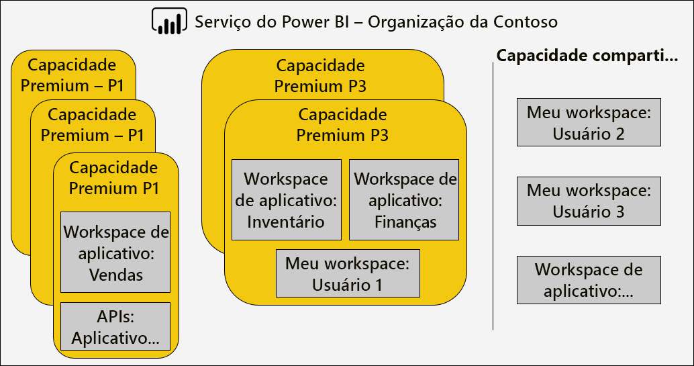

Uma capacidade Premium pode ser atribuída a uma região diferente de região de residência do locatário do Power BI, fornecendo o controle administrativo sobre quais datacenters (dentro de regiões geográficas definidas) o conteúdo do Power BI reside. \[[12](#endnote-12)\]

Os administradores de serviço do Power BI e administradores globais do Office 365 podem modificar as capacidades Premium. Especificamente, eles podem:

- Altere o tamanho da capacidade para escalar verticalmente ou reduzir verticalmente os recursos. No entanto, não é possível fazer o downgrade de uma SKU P para um SKU EM, ou vice-versa de atualização.
- Adicionar ou remover administradores de capacidade
- Adicionar ou remover usuários que têm permissões de atribuição
- Adicionar ou remover as cargas de trabalho adicionais
- Alterar regiões

São necessárias permissões de atribuição para atribuir um espaço de trabalho a uma capacidade Premium específica. As permissões podem ser concedidas para a organização inteira, usuários ou grupos específicos.

Por padrão, as capacidades Premium dão suporte a cargas de trabalho associadas à execução de consultas no Power BI. Ele também dá suporte a três cargas de trabalho adicionais: **Relatórios paginados**, **fluxos de dados**, e **AI**. Cada carga de trabalho exige a configuração a memória máxima (como uma porcentagem do total de memória disponível) que pode ser usada pela carga de trabalho. É importante entender o que pode afetar os aumentar as alocações de memória máximo no número de modelos de Active Directory que pode ser hospedado e a taxa de transferência de atualizações.

A memória é dinamicamente alocada para fluxos de dados, mas é alocada estaticamente para relatórios paginados. O motivo para alocar estaticamente a memória máxima é que os relatórios paginados executado dentro de um espaço protegido de independente da capacidade. Tome cuidado quando configuração paginado relatórios memória, pois reduz a memória disponível para carregar modelos.

|                     | EM3                      | P1                       | P2                      | P3                       |
|---------------------|--------------------------|--------------------------|-------------------------|--------------------------|
| Relatórios paginados | N/D | Padrão de 20%; mínimo de 10% | Padrão de 20%; mínimo de 5% | Padrão de 20%; mínimo de 2,5% |
| Fluxos de dados | Padrão de 20%; mínimo de 8%  | Padrão de 20%; mínimo de 4%  | Padrão de 20%; mínimo de 2% | Padrão de 20%; mínimo de 1%  |
| AI | N/D | padrão de 20%; 20% (mínimo)  | Padrão de 20%; mínimo de 10% | Padrão de 20%; mínimo de 5%  |
| | | | | |

Excluir uma capacidade Premium, é possível e não resultará na exclusão de seus espaços de trabalho e o conteúdo. Em vez disso, ele moverá nenhum espaço de trabalho atribuído à capacidade compartilhada. Quando a capacidade Premium foi criada em uma região diferente, o espaço de trabalho será movido para uma capacidade compartilhada da região de residência.

### Atribuir espaços de trabalho para as capacidades

Espaços de trabalho podem ser atribuídos a uma capacidade Premium na **administrador do Power BI** **Portal** ou - para um espaço de trabalho de aplicativo - na **espaço de trabalho** painel.

Os administradores de capacidade, bem como os administradores globais do Office 365 ou administradores de serviço do Power BI, podem atribuir espaços de trabalho em fazer em massa a **administrador do Power BI** **Portal**. Em massa atribuída pode aplicar a:

- **Espaços de trabalho por usuários** : Todos os espaços de trabalho pertencentes a esses usuários, incluindo espaços de trabalho pessoas, são atribuídos à capacidade Premium. Isso incluirá a reatribuição de espaços de trabalho quando eles já estão atribuídos a uma capacidade Premium diferente. Além disso, os usuários também recebem permissões de atribuição de espaço de trabalho.

- **Workspaces específicos**
- **Espaços de trabalho de toda a organização** : Todos os espaços de trabalho, incluindo espaços de trabalho pessoas, são atribuídos à capacidade Premium. Além disso, todos os usuários atuais e futuros são atribuídos as permissões de atribuição de espaço de trabalho. \[[14](#endnote-14)\]

Um espaço de trabalho pode ser adicionado a uma capacidade Premium usando o **espaço de trabalho** painel fornecendo ao usuário é um administrador do espaço de trabalho e tem permissões de atribuição.

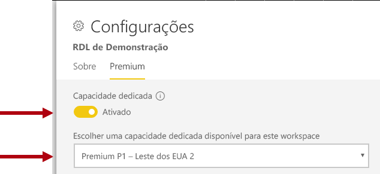

Os administradores do espaço de trabalho podem remover um espaço de trabalho de uma capacidade (capacidade compartilhada) sem a necessidade de permissões de atribuição. Remover espaços de trabalho da capacidade dedicada efetivamente Realoca espaço de trabalho para capacidade compartilhada. Observe que a remoção de um espaço de trabalho de uma capacidade Premium pode ter consequências negativas, resultando, por exemplo, conteúdo compartilhado se torne indisponível para o Power BI gratuito licenciado usuários ou a suspensão de atualização agendada quando elas excedem as concessões com suporte por capacidade compartilhada.

No serviço do Power BI, um espaço de trabalho atribuído a uma capacidade Premium será facilmente identificado pelo ícone de losango que adorna o nome do espaço de trabalho.

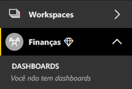

### Capacidades de monitoramento

Monitoramento de capacidades Premium fornece aos administradores uma compreensão de como as capacidades são executados. As capacidades podem ser monitoradas usando o [aplicativo de métricas de capacidade do Power BI Premium](service-admin-premium-monitor-capacity.md) ou o [portal de administração do Power BI](service-admin-premium-monitor-portal.md).

#### Interpretando as métricas

As métricas devem ser monitoradas para estabelecer uma compreensão de linha de base de atividade de carga de trabalho e uso do recurso. Se a capacidade de se tornar lento, é importante entender quais métricas para monitorar e as conclusões que você pode fazer.

O ideal é que consultas deverá concluir dentro de um segundo para proporcionar experiências responsivas a usuários de relatório e permitir maior taxa de transferência de consulta. Geralmente é uma preocupação menor quando faz com que os processos em segundo plano – incluindo atualizações - vezes mais tempo para concluir.

Em geral, os relatórios lentos podem ser uma indicação de uma capacidade de superaquecimento. Quando os relatórios de falham ao carregar, isso é uma indicação de uma capacidade em excesso aquecida. Em qualquer situação, a causa raiz pode ser atribuível a muitos fatores, incluindo:

- **Consultas com falha** certamente indicar pressão de memória e um modelo não pôde ser carregado na memória. O serviço do Power BI tentará carregar um modelo por 30 segundos antes de falhar.

- **Tempos de espera de consulta excessiva** pode ser devido a vários motivos:
  - A necessidade de serviço do Power BI, primeiro remova o modelo (s) e, em seguida, carregar o modelo será consultada (Lembre-se que taxas mais altas de conjunto de dados remoção sozinhas não são uma indicação de estresse de capacidade, a menos que acompanhada por consulta tempos de espera longos que indicam a sobrecarga de memória)
  - Tempo de carregamento modelo (especialmente a espera para carregar um modelo grande na memória)
  - Consultas de longa execução
  - Número excessivo de conexões LC\DQ (excedendo os limites de capacidade)
  - Saturação da CPU
  - Designs de relatório complexo com um número excessivo de elementos visuais em uma página (Lembre-se que cada elemento visual é uma consulta)
- **As durações de consulta longa** pode indicar que os designs de modelo não são otimizados, especialmente quando vários conjuntos de dados estão ativos em uma capacidade, e apenas um conjunto de dados está produzindo durações de consulta longa. Isso sugere que a capacidade é recursos suficientemente, e se o conjunto de dados em questão está apenas lenta ou abaixo do ideal. Consultas de longa execução pode ser problemático porque pode bloquear o acesso a recursos exigida por outros processos.
- **Atualização longa tempos de espera ou tempos de espera de chamada de AI** indicar memória insuficiente, devido a muitos modelos de Active Directory, consumindo memória ou uma atualização de um problema está impedindo a outra é atualizada (excedendo limites de atualização paralela).

Uma explicação mais detalhada de como usar as métricas é abordada em seguida o [otimizando as capacidades do Premium](#optimizing-premium-capacities) seção.

## Otimizando as capacidades Premium

Quando surgem problemas de desempenho de capacidade Premium, uma primeira abordagem comum é otimizar ou ajustar soluções já implantado para restaurar os tempos de resposta aceitável. A lógica de substituição é evitar a compra de mais capacidade Premium, a menos que ele pode ser justificado.

Quando a capacidade de Premium adicional for necessária, há duas opções que serão discutidas mais adiante nesta seção:

- Escalar verticalmente a capacidade Premium
- Adicionar uma nova capacidade Premium

Por fim, teste as abordagens e dimensionamento de capacidade Premium conclua esta seção.

### Práticas recomendadas gerais

Quando se esforçam para alcançar melhor utilização e desempenho, não há são algumas práticas recomendadas que podem ser executadas na placa como recomendações gerais. Elas incluem:

- Usando espaços de trabalho do aplicativo em vez de espaços de trabalho pessoas
- Separação de negócios críticos e BI de autoatendimento (SSBI) em diferentes capacidades

  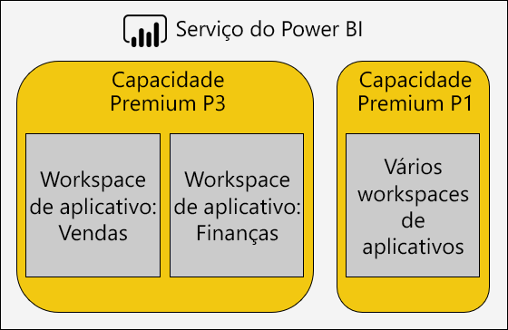

- Se o compartilhamento de conteúdo somente com usuários do Power BI Pro, não pode haver nenhuma necessidade de armazenar o conteúdo em uma capacidade dedicada
- Usar as capacidades dedicadas quando desejam para obter um tempo de atualização específico, ou quando recursos específicos são necessários, por exemplo, grandes conjuntos de dados ou paginado reporting

### Responder a questões comuns

Otimizar as implantações do Power BI Premium é um tópico complexo que envolve um entendimento dos requisitos de carga de trabalho, recursos disponíveis e seu uso efetivo.

Este tópico aborda os sete perguntas comuns de suporte, que descreve possíveis problemas e explicações e obter informações sobre como identificar e resolvê-los.

#### Por que é a capacidade lenta, e o que devo fazer?

Há muitas razões podem contribuir para uma capacidade Premium lenta. Essa questão ainda mais requer informações para entender o que significa lenta. Relatórios são lentos para carregar? Ou eles estão falhando ao carregar? Elementos visuais de relatório são lentas para carregar ou atualizar quando os usuários interagem com o relatório? As atualizações estão demorando mais tempo concluir que o esperado ou anteriormente experimentado?

Tendo obtido um entendimento do motivo, você pode começar a investigar. As respostas às seguintes seis perguntas ajudará você a resolver mais problemas específicos.

#### O conteúdo que está usando minha capacidade?

Você pode usar o **métricas de capacidade do Power BI Premium** aplicativo filtrar por capacidade e analisar as métricas de desempenho para o conteúdo do espaço de trabalho. É possível examinar o uso de recursos e as métricas de desempenho por hora nos últimos sete dias para todo o conteúdo armazenado dentro da capacidade Premium. Isso geralmente é a primeira etapa a ser tomada quando a solução de problemas de uma preocupação geral sobre o desempenho de capacidade Premium.

Para monitorar métricas-chave incluem:

- Média de CPU e a contagem de alta utilização
- Média de memória e contagem de alta utilização e uso de memória para conjuntos de dados específicos, fluxos de dados e relatórios paginados
- Conjuntos de dados ativos carregados na memória
- Durações de consulta de média e máxima
- Tempos de espera médio de consulta
- Tempos de atualização de fluxo de dados e o conjunto de dados média
- AI médio chamar vezes e tempos de espera

Além disso, no aplicativo Power BI Premium capacidade métricas, memória ativa mostra a quantidade total de memória alocada a um relatório que não pode ser removido porque ela está em uso nos últimos três minutos. Um pico alta no tempo de espera de atualização pode estar correlacionado com um conjunto de dados grande e/ou ativo.

O gráfico "Top 5 por duração média" destaca os cinco principais conjuntos de dados, relatórios paginados, fluxos de dados e chamadas de inteligência Artificial, consumindo recursos de capacidade. Conteúdo nas listas de cinco principais são candidatos para otimização de investigação e possíveis.

#### Por que são relatórios lento?

As tabelas a seguir mostram os possíveis problemas e maneiras de identificar e lidar com eles.

##### Recursos de capacidade insuficiente

| Possíveis explicações | Como identificar | Como resolver |
| --- | --- | --- |
| Alta memória ativa total (modelo não pode ser removido porque ele está em uso nos últimos três minutos)   Vários picos alta de tempos de espera de consulta   Tempos de espera de vários picos alta na atualização | Monitorar as métricas de memória \[ [18](#endnote-18)\]e as contagens de remoção \[ [19](#endnote-19)\] | Diminuir o tamanho do modelo, ou converter para o modo DirectQuery - consulte o [otimizando modelos](#optimizing-models) tópico nesta seção   Escalar verticalmente a capacidade   Atribuir o conteúdo a uma capacidade diferente |

##### Designs de relatório ineficiente

| Possíveis explicações | Como identificar | Como resolver |
| --- | --- | --- |
| As páginas do relatório contém vários elementos visuais (filtragem interativa pode disparar pelo menos uma consulta por visual)   Elementos visuais recuperam mais dados que o necessário | Examine os designs de relatório   Usuários de relatório para entender como eles interagem com os relatórios de entrevistas   Monitorar as métricas de consulta de conjunto de dados \[ [20](#endnote-20)\] | Relatórios de reformulação com menos visuais por página |

##### Conjunto de dados lenta (especialmente quando relatórios anteriormente executou bem)

| Possíveis explicações | Como identificar | Como resolver |
| --- | --- | --- |
| Cada vez mais grandes volumes de dados de importação   Lógica de cálculo complexo ou ineficiente, incluindo funções RLS   Modelo não totalmente otimizado   (DQ/LC) Latência do gateway   Lento tempos de resposta de consulta para origem DQ | Examine os designs de modelo   Monitorar contadores de desempenho do gateway | Consulte a [otimizando modelos](#optimizing-models) tópico nesta seção |

##### Uso de relatórios simultâneas alta

| Possíveis explicações | Como identificar | Como resolver |
| --- | --- | --- |
| Tempos de espera de consulta altas   Saturação da CPU   Limites de conexão do DQ/LC excedidos | Monitorar a utilização de CPU \[ [21](#endnote-21)\], tempos de espera de consulta e a utilização de DQ/LC \[ [22](#endnote-22) \] métricas + durações de consulta – se puder flutuando indicar problemas de simultaneidade | Escalar verticalmente a capacidade ou atribuir o conteúdo a uma capacidade diferente   Relatórios de reformulação com menos visuais por página |

#### Por que são os relatórios não está carregando?

Quando relatórios de falham para carregá-lo é um cenário de pior caso e um sinal-se de que a capacidade não tem memória suficiente e é excessivamente aquecida. Isso pode ocorrer quando todos os modelos carregados estão sendo consultados ativamente e portanto não podem ser removidos e qualquer operação de atualização ter sido pausada ou atrasada. O serviço do Power BI tentará carregar o conjunto de dados por 30 segundos e, normalmente, o usuário é notificado da falha com uma sugestão para tentar novamente em breve.

Atualmente, não há nenhuma métrica para monitorar os relatórios de falhas de carregamento. Você pode identificar o potencial para esse problema, memória do sistema de monitoramento, especificamente a mais alta utilização e tempo de utilização mais alta. Remoções de conjunto de dados de alta e longa dataset tempo de espera médio de atualização podem sugerir que esse problema está ocorrendo.

Se isso ocorrer somente ocasionalmente muito, isso pode não ser considerado um problema de prioridade. Os usuários de relatório serão informados que o serviço está ocupado e que deve tentar novamente após alguns instantes. Se isso acontecer com muita frequência, o problema pode ser resolvido pelo aumento da capacidade Premium, ou atribuindo o conteúdo a uma capacidade diferente.

Administradores de capacidade (e os administradores de serviço do Power BI) pode monitorar o **falhas de consulta** métrica para determinar quando isso acontece. Eles também podem reiniciar a capacidade, redefinir todas as operações no caso de sobrecarga do sistema.

#### Por que as atualizações não estão iniciando em agendamento?

Não há garantia de horas de início da atualização agendada. Lembre-se de que o serviço do Power BI sempre será priorizar operações interativas sobre operações em segundo plano. A atualização é uma operação em segundo plano que pode ocorrer quando duas condições forem atendidas:

- Não há memória suficiente
- O número de atualizações simultâneas com suporte para a capacidade de Premium não for excedido

Quando as condições não forem atendidas, a atualização está na fila até que as condições forem favoráveis.

Para uma atualização completa, lembre-se de que pelo menos duas vezes o tamanho de memória atual do conjunto de dados é necessária. Se não tiver memória suficiente disponível, a atualização não pode começar até que a remoção do modelo libera memória - isso significa atrasos até que um ou mais conjuntos de dados se torna inativo e podem ser removido.

Lembre-se de que o número de atualizações simultâneas máximo com suporte é definido como 1,5 vezes os back-end núcleos, arredondados para cima.

Uma atualização agendada falhará quando ele só poderá ser iniciado antes da próxima atualização agendada está prestes a começar. Uma atualização sob demanda que disparou manualmente na interface de usuário tentará executar até três vezes antes de falhar.

Administradores de capacidade (e os administradores de serviço do Power BI) pode monitorar o **Refresh tempo de espera médio (minutos)** métrica para determinar a latência média entre o horário agendado e o início da operação.

Enquanto geralmente não atualiza uma prioridade administrativa, para influenciar a dados em tempo, verifique se há memória suficiente disponível. Isso pode envolver a isolar os conjuntos de dados para as capacidades com recursos suficientes conhecidos. Também é possível que os administradores poderiam coordenar com os proprietários de conjunto de dados para ajudar a escalonar ou reduzir os tempos de atualização de dados agendada para minimizar colisões. Observe que não é possível que um administrador exibir a fila de atualização, ou recuperar o conjunto de dados de agenda.

#### Por que são atualizações lentas?

Atualizações podem ser lento - ou percebida lenta (como os endereços de pergunta comum anterior).

Quando na verdade, a atualização estiver lenta, pode ser devido a vários motivos:

- CPU insuficientes (atualização pode ser muito intensivo de CPU)
- Memória insuficiente, resultando em pausa de atualização (que exige a atualização para iniciar novamente quando as condições forem favoráveis recomeçar)
- Motivos de não-capacidade, incluindo a resposta do sistema de origem de dados, latência de rede, permissões inválidas ou taxa de transferência de gateway
- Volume de dados - um bom motivo para configurar incremental de atualização, conforme discutido abaixo

Administradores de capacidade (e os administradores de serviço do Power BI) pode monitorar o **Refresh média duração (minutos)** métrica para determinar um parâmetro de comparação para comparação com o tempo e o **atualização de tempo de espera médio (minutos)** métricas para determinar a latência média entre média de latência entre o horário agendado e o início da operação.

Atualização incremental pode reduzir significativamente a duração da atualização de dados, especialmente para tabelas de modelo grande. Há quatro benefícios associados com a atualização incremental:

- **As atualizações são mais rápidas** : Apenas um subconjunto de uma tabela precisa carregar, reduzindo o uso da CPU e memória, e paralelismo pode ser superior ao atualizar várias partições
- **As atualizações ocorrem apenas quando necessário** : Políticas de atualização incremental podem ser configuradas para carregar apenas quando os dados foram alterados
- **As atualizações são mais confiáveis** : Conexões em execução mais curtas para sistemas de fonte de dados voláteis são menos suscetíveis a desconexão
- **Modelos permanecem corte** : Políticas de atualização incremental podem ser configuradas para remover automaticamente o histórico, além de uma janela deslizante de tempo

Para obter mais informações, consulte o [Incremental de atualização no Power BI Premium](service-premium-incremental-refresh.md) documento.

#### Por que são dados atualiza não concluir?

Quando a atualização de dados começa, mas não for concluída, pode ser devido a vários motivos:

- Memória insuficiente, mesmo se houver apenas um modelo na capacidade Premium, ou seja, o tamanho do modelo é muito grande
- Motivos de não-capacidade, incluindo dados de origem desconexão de sistema, permissões inválidas ou erro de gateway

Administradores de capacidade (e os administradores de serviço do Power BI) pode monitorar o **Refresh falhas devido à memória insuficiente** métrica.

#### Por que são chamadas de AI falhando?

Chamadas de inteligência Artificial podem falhar por vários motivos. A memória mínima necessária para iniciar o AI carga de trabalho é de 5 GB, mas isso pode não ser suficiente para alguns conjuntos de dados de entrada. Por exemplo, treinamento do modelo de aprendizado de máquina automatizada requer pelo menos duas vezes e, às vezes, várias vezes o tamanho de conjunto de dados de entrada. Além disso, uma chamada de AI será finalizada se demorar mais de duas horas para ser concluído. Máquina automatizada chamadas de treinamento de modelo que não é concluída em duas horas, o melhor modelo encontrado nessas duas horas de aprendizado será retornado.  Chamadas de AI também podem ser interrompidas por solicitações interativas, que têm precedência.

Os administradores devem monitorar tempos de espera de inteligência Artificial em busca de sinais de outras solicitações tendo precedência. Os administradores também podem garantir que a memória suficiente está disponível para a carga de trabalho de AI em relação a tamanhos de dados de entrada. Isso pode envolver a isolar as cargas de trabalho de IA para as capacidades conhecidas por ter recursos suficientes. Também é possível que os administradores poderiam coordenar com os proprietários de fluxo de dados para ajudar a escalonar ou reduzir os tempos de atualização de fluxo de dados para minimizar colisões. Observe que não é possível que um administrador exibir a fila de chamada de inteligência Artificial.

### Otimizando modelos

Design de modelo ideal é crucial para o fornecimento de uma solução eficiente e escalonável. No entanto, ele é além do escopo deste white paper fornece uma discussão completa. Em vez disso, esta seção fornecerá áreas-chave para consideração durante a otimização de modelos.

#### Otimizando modelos de Power BI hospedados

Otimizando modelos hospedados em uma capacidade Premium podem ser obtidos nas camadas de fonte (s) e o modelo de dados.

Considere as possibilidades de otimização para um modelo de importação:

Na camada de fonte de dados:

- Fontes de dados relacionais podem ser otimizadas para garantir que o mais rápido possível de atualização com pré-integração de dados, aplicando índices apropriados, definindo as partições de tabela que se alinham a atualização incremental períodos e cálculos a materialização (em vez de calculados tabelas e colunas de modelo) ou a adição de lógica de cálculo para modos de exibição
- Fontes de dados não relacionais podem ser previamente integrados com repositórios relacionais
- Certifique-se de que os gateways possuem recursos suficientes, preferencialmente em computadores dedicados, com largura de banda suficiente e, em estreita proximidade com as fontes de dados

Na camada de modelo:

- Design de consulta do Power Query pode minimizar ou remover transformações complexas e especialmente aquelas que diferentes fontes de dados (data warehouse conseguir isso durante sua fase de extração, transformação e carregamento) de mesclagem. Além disso, garantindo que os níveis de privacidade de fonte de dados apropriadas estão definidos, isso pode evitar a necessidade de Power BI para carregar os resultados completos para produzir um resultado combinado em consultas.
- A estrutura do modelo determina os dados a serem carregados e tem um impacto direto sobre o tamanho do modelo. Ele pode ser projetado para evitar o carregamento de dados desnecessários, removendo colunas, remover linhas (especialmente os dados históricos) ou pelo carregamento de dados resumidos (a custa de carregamento de dados detalhados). Redução de tamanho significativo pode ser obtida, removendo colunas de alta cardinalidade (especialmente a colunas de texto) que não armazenar ou compactar com muita eficiência.
- Desempenho de consulta do modelo pode ser melhorado configurando relações de direção única, a menos que haja um motivo convincente para permitir a filtragem bidirecional. Considere também usar a função CROSSFILTER em vez de filtragem bidirecional.
- Tabelas de agregação podem alcançar consulta rápida respostas Carregando previamente resumidos dados, no entanto, isso aumentará o tamanho do modelo e o resultado em tempos de atualização. Em geral, as tabelas de agregação devem ser reservadas para modelos muito grandes ou projetos de modelo composto.
- Colunas e tabelas calculadas aumentam o tamanho do modelo e resultam em tempos de atualização. Em geral, um tamanho menor de armazenamento e o tempo mais rápido de atualização podem ser obtidos quando os dados são materializados ou calculados na fonte de dados. Se isso não for possível, usar colunas personalizadas do Power Query pode oferecer armazenamento aprimorada de compactação.
- Pode haver uma oportunidade para ajustar expressões DAX para medidas e as regras RLS, talvez reescrever a lógica para evitar a caras fórmulas
- Atualização incremental drasticamente pode reduzir o tempo de atualização e conservar a memória e CPU. A atualização incremental também pode ser configurada para remover dados históricos, mantendo os tamanhos de modelo de corte.
- Um modelo pode ser reprojetado como modelos quando há padrões de consulta diferentes e conflitantes. Por exemplo, alguns relatórios agregados de alto nível presentes em todos os histórico e pode toleram a latência de 24 horas. Outros relatórios estão preocupados com dados atuais e precisam de acesso granular para transações individuais. Em vez de design de um único modelo para atender a todos os relatórios, crie dois modelos otimizados para cada requisito.

Considere as possibilidades de otimização para um modelo DirectQuery. Como o modelo emite solicitações de consulta à fonte de dados subjacente, otimização de fonte de dados é essencial para o fornecimento de consultas de modelo dinâmico.

 

Na camada de fonte de dados:

- A fonte de dados pode ser otimizada para garantir que a consulta mais rápido possível integrando previamente os dados (que não não possíveis na camada de modelo), a aplicação de índices apropriados, definir as partições de tabela, a materialização resumidos dados (com exibições indexadas), e minimizar a quantidade de cálculo. A melhor experiência é obtida quando as consultas de passagem precisam apenas de filtro e executar junções internas entre os modos de exibição ou tabelas indexadas.
- Certifique-se de que os gateways possuem recursos suficientes, preferencialmente em computadores dedicados, com largura de banda suficiente e, em estreita proximidade com a fonte de dados

Na camada de modelo:

- Consulta do Power Query designs preferencialmente devem ser aplicados sem transformações - caso contrário, tente manter as transformações para absoluta mínimo
- Desempenho de consulta do modelo pode ser melhorado configurando relações de direção única, a menos que haja um motivo convincente para permitir a filtragem bidirecional. Além disso, as relações do modelo devem ser configuradas para assumir a integridade referencial é imposta (quando esse for o caso) e resultará em consultas de fonte de dados usando as junções mais eficientes (em vez de junções externas).
- Evite criar colunas personalizadas de consulta Power Query ou coluna calculada de modelo – materializar essas na fonte de dados, quando possível
- Pode haver uma oportunidade para ajustar expressões DAX para medidas e as regras RLS, talvez reescrever a lógica para evitar a caras fórmulas

Considere as possibilidades de otimização para um modelo de composição. Lembre-se de que um modelo de composição permite uma combinação de importação e DirectQuery tabelas.

- Em geral, os tópicos de otimização para modelos de importação e DirectQuery se aplicam às tabelas de modelo composto que usam esses modos de armazenamento.
- Normalmente, se esforçam para chegar a um design equilibrado por meio da configuração de tabelas do tipo de dimensão (que representa as entidades de negócios) como duplo modo e o tipo de fato tabelas de armazenamento (tabelas grandes com frequência, que representam fatos operacionais) como modo de armazenamento DirectQuery. Modo de armazenamento duplo significa que ambos importar e modos de armazenamento do DirectQuery e isso permite que o serviço do Power BI determinar o modo de armazenamento mais eficiente para usar ao gerar uma consulta nativa de passagem.
- Certifique-se de que os gateways possuem recursos suficientes, preferencialmente em computadores dedicados, com largura de banda suficiente e, em estreita proximidade com as fontes de dados
- Tabelas de agregações configurado como modo de armazenamento de importação pode fornecer aprimoramentos de desempenho de consulta dramática quando usados para resumir as tabelas de fatos-tipo de modo de armazenamento DirectQuery. Nesse caso, aumentará o tamanho do modelo e aumentar o tempo de atualização de tabelas de agregação e geralmente é uma compensação aceitável para consultas mais rápidas.

#### Otimizando modelos hospedados externamente

Muitas possibilidades de otimização discutidas a [Optimizing Power BI-Hosted modelos](#optimizing-power-bi-hosted-models) tópico também se aplicam a modelos desenvolvidos com o Azure Analysis Services e o SQL Server Analysis Services. Limpar exceções são determinados recursos que não são atualmente suportados, incluindo modelos de composição e tabelas de agregação.

Uma consideração adicional sobre os conjuntos de dados hospedados externamente é o banco de dados de hospedagem em relação ao serviço do Power BI. Para o Azure Analysis Services, isso significa criar o recurso do Azure na mesma região que o locatário do Power BI (região de residência). Para SQL Server Analysis Services, para IaaS, isso significa que hospeda a VM na mesma região e para o local, isso significa que garantir uma instalação do gateway eficiente.

Como um aparte, é interessante observar que os bancos de dados do Azure Analysis Services e bancos de dados tabulares do SQL Server Analysis Services exigem que seus modelos carregados totalmente na memória e que eles permanecem lá em todos os momentos para dar suporte à consulta. Como o serviço do Power BI, deve haver memória suficiente para se atualizar se o modelo deve permanecer online durante a atualização. Ao contrário do serviço do Power BI, não há nenhum conceito de que os modelos são automaticamente antigos dentro e fora de memória de acordo com o uso. O Power BI Premium, portanto, oferece uma abordagem mais eficiente para maximizar a consulta de modelo com o uso de memória inferior.

### Planejamento de capacidade

O tamanho de uma capacidade Premium determina sua memória disponível e os recursos de processador e os limites impostos na capacidade. O número de capacidades Premium também é uma consideração, como criação de vários Premium capacidades podem ajudar a isolar as cargas de trabalho umas das outras. Observe que o armazenamento é 100 TB por nó de capacidade, e isso provavelmente será mais do que suficiente para qualquer carga de trabalho.

Determinar o tamanho e o número de capacidades Premium pode ser desafiador, especialmente para as capacidades inicias que você cria. A primeira etapa ao dimensionamento de capacidade é entender a carga de trabalho média que representa o uso diário esperado. É importante entender que nem todas as cargas de trabalho são iguais. Por exemplo, no fim de um espectro - 100 usuários simultâneos que acessam uma única página de relatório que contém um único visual é facilmente realizável. Ainda - na outra extremidade do espectro - 100 usuários simultâneos acessam 100 relatórios diferentes, cada um com 100 visuais na página do relatório, será muito diferentes demandas de recursos de capacidade de fazer.

Os administradores de capacidade, portanto, serão necessário considerar vários fatores específicos ao seu ambiente, o conteúdo e o uso esperado. O objetivo de substituição é maximizar a utilização da capacidade oferecendo os tempos de consulta consistentes, tempos de espera aceitável e taxas de remoção. Fatores a serem considerados incluem:

- **Características de tamanho e os dados de modelo** : Modelos de importação devem ser totalmente carregados na memória para permitir que a consulta ou atualização. LC/DQ conjuntos de dados podem exigir muito tempo do processador e memória significativa, possivelmente, para avaliar medidas complexas ou regras RLS. Taxa de transferência de consulta LC/DQ e tamanho de processador e memória são restritas pelo tamanho da capacidade.
- **Modelos active simultâneos** : A consulta simultâneas dos modelos de importação diferente fornecerá melhor capacidade de resposta e o desempenho quando eles permanecem na memória. Deve haver memória suficiente para hospedar todos os modelos intensamente consultados, com memória adicional para permitir a sua atualização.
- **Atualização do modelo de importação** : O tipo de atualização (completo ou incremental), a duração e a complexidade de consultas do Power Query e a lógica de tabela/coluna calculada podem ter impacto na memória e uso do processador especialmente. Atualizações simultâneas são restritas pelo tamanho da capacidade (1,5 x backend núcleos, arredondados para cima).
- **Consultas simultâneas** : Várias consultas simultâneas podem resultar em relatórios sem resposta quando o processador ou LC/DQ conexões excede o limite de capacidade. Isso é especialmente o caso para páginas de relatório que incluem muitos visuais.
- **Paginado de fluxos de dados, relatórios e funções de inteligência Artificial** : A capacidade pode ser configurada para dar suporte a fluxos de dados, relatórios paginados e funções de inteligência Artificial, cada um exigindo uma configurável porcentagem máxima de memória de capacidade. Memória dinamicamente alocada para fluxos de dados, mas ele é alocado estaticamente para relatórios paginados e a carga de trabalho de AI.

Além desses fatores, os administradores de capacidade podem pensar em criar várias capacidades. Várias capacidades permitem o isolamento de cargas de trabalho e podem ser configuradas para garantir que as cargas de trabalho de prioridade têm a garantia de recursos. Por exemplo, duas capacidades podem ser criadas para separar as cargas de trabalho essenciais aos negócios de cargas de trabalho de Self-service BI (SSBI). A capacidade de críticos de negócios pode ser usada para isolar grandes modelos corporativos, fornecendo a eles com recursos garantidos, com a criação de acesso concedido apenas ao departamento de TI. A capacidade SSBI pode ser usada para hospedar um número crescente de modelos menores, com acesso concedido a analistas de negócios. A capacidade SSBI às vezes pode enfrentar esperas de consulta ou atualização toleráveis.

Ao longo do tempo, os administradores de capacidade pode equilibrar os espaços de trabalho entre as capacidades, movendo o conteúdo entre espaços de trabalho ou espaços de trabalho entre as capacidades e expandindo as capacidades para cima ou para baixo. Em geral, para hospedar maiores modelos você escala verticalmente e para maior simultaneidade você escalar horizontalmente.

Lembre-se de que a comprar uma licença fornece ao locatário núcleos. A compra de um **P3** assinatura pode ser usada para criar uma ou, até quatro capacidades de Premium, ou seja, 1 x P3, ou 2 vezes P2 ou 4 x P1. Além disso, antes de upsizing uma capacidade de P2 a uma capacidade P3, consideração pode ser fornecida para dividir os núcleos virtuais para criar duas capacidades de P1.

### Abordagens de teste

Depois que um tamanho de capacidade é decidido, testes podem ser executadas com a criação de um ambiente controlado. É uma opção econômica e prática criar uma capacidade do Azure (SKUs a), observar que uma capacidade de P1 é o mesmo tamanho de uma capacidade de A4, P2 e P3 capacidades do mesmo tamanho que as capacidades de A5 e A6, respectivamente. As capacidades do Azure podem ser criadas rapidamente e são cobradas por hora. Assim, depois que o teste for concluído, eles podem ser facilmente excluídos para interromper o acúmulo de custos.

O conteúdo de teste pode ser adicionado a espaços de trabalho criados na capacidade do Azure e, em seguida, como um único usuário pode executar relatórios para gerar uma carga de trabalho real e representativa das consultas. Se não houver modelos de importação, uma atualização para cada modelo deve ser realizada também. Ferramentas de monitoramento, em seguida, podem ser usada para examinar todas as métricas para entender a utilização de recursos.

É importante que os testes são repetidos: Testes devem ser executados várias vezes e eles devem fornecer aproximadamente o mesmo resultado cada vez. Uma média desses resultados pode ser usada para extrapolar e estimar uma carga de trabalho sob condições de produção true.

Para gerar um teste de estresse, considere desenvolver uma aplicativo para simular a carga de trabalho real de teste de carga. As especificações de como fazer isso estão fora do escopo deste white paper. Para obter mais informações, incluindo um exemplo de código, consulte o [carga testando o Power BI aplicativos com o teste de carga do Visual Studio](https://blogs.msdn.microsoft.com/charles_sterling/2018/04/04/webinar-load-testing-power-bi-applications-with-visual-studio-load-test/) webinar.

## Explorar cenários do mundo Real

Nesta seção, serão introduzidos vários cenários do mundo real para descrever os desafios ou problemas comuns, como identificá-los e como ajudar a resolvê-los:

- [Manter atualizados os conjuntos de dados](#keeping-datasets-up-to-date)
- [Identificando conjuntos de dados de resposta lenta](#identifying-slow-responding-datasets)
- [Identificando as causas para lento-respondendo esporadicamente conjuntos de dados](#identifying-causes-for-sporadically-slow-responding-datasets)
- [Determinando se há memória suficiente](#determining-whether-there-is-enough-memory)
- [Determinando se há suficiente CPU](#determining-whether-there-is-enough-cpu)

As etapas, junto com exemplos de gráfico e tabela são do **aplicativo de métricas de capacidade do Power BI Premium** (aplicativo) que um administrador do Power BI terá acesso ao.

### Manter conjuntos de dados até a data

Nesse cenário, uma investigação foi acionada quando os usuários reclamam que dados de relatório, às vezes, parecem ser antigos ou "obsoletas".

No aplicativo, o administrador interage com o **atualiza** visual, classificando conjuntos de dados, o **de tempo de espera máximo** estatísticas em ordem decrescente. Isso os ajuda a revelar tempos, agrupados por nome do espaço de trabalho de espera de conjuntos de dados que tem mais tempo.

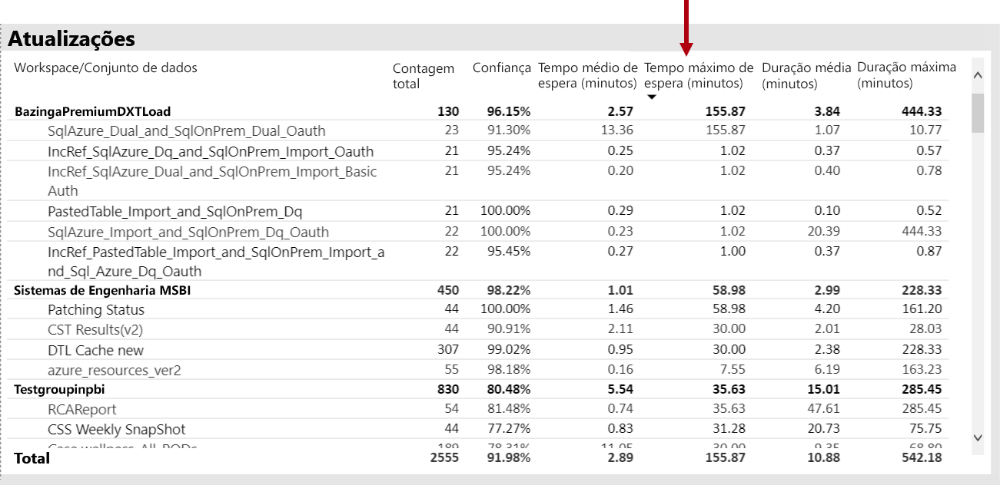

Além disso, o **por hora de atualização esperar tempos médios** visual, eles Observe que os tempos de espera de atualização consistentemente pico aproximadamente 16 horas por dia.

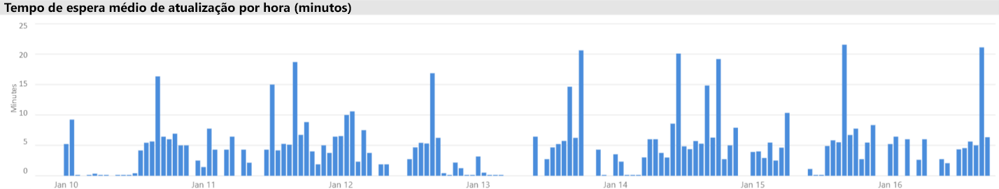

Há várias possíveis explicações para esses resultados:

- Muitas tentativas de atualização podem estar ocorrendo ao mesmo tempo, excedendo os limites impostos pelo nó de capacidade (seis atualizações simultâneas em um P1 com alocação de memória padrão)

- Conjuntos de dados a ser atualizado podem ser muito grandes para caber na memória disponível (que exige pelo menos 2 vezes a memória necessária para atualização completa)
- Lógica ineficiente do Power Query pode ser resultando em um pico de uso de memória durante a atualização de conjunto de dados. Em uma capacidade ocupada isso ocasionalmente pode alcançar o limite físico, fazendo a atualização e potencialmente afetar outras operações do modo de exibição de relatório na capacidade.
- Conjuntos de dados consultados com frequência que precisam para ficar na memória podem afetar a capacidade de outros conjuntos de dados para atualizar, devido a memória disponível limitada

Para ajudar a investigar isso, o administrador do Power BI pode procurar por:

- Memória insuficiente disponível no momento da atualização de dados, quando a memória disponível for menor que 2 vezes o tamanho do conjunto de dados a ser atualizado
- Conjuntos de dados que não foram atualizados e não estavam na memória antes de uma atualização, mas que começou a mostrar o tráfego interativo durante tempos de atualização pesadas. Para ver quais conjuntos de dados foram carregados na memória em um determinado momento um Power BI administrador pode examinar a área de conjuntos de dados do **Datasets** guia no filtro cruzado e de aplicativo para um determinado momento clicando em uma das barras no **por hora Carregado contagens de conjunto de dados**. Um aumento de local (mostrado na imagem abaixo) indica uma hora quando vários conjuntos de dados foram carregados em memória, que pode atrasar o início de atualizações agendadas
- Remoções de conjunto de dados maior tomando colocar quando as atualizações de dados estão agendadas para iniciar, indicando que houve alta pressão de memória causado por que atende a muitos relatórios interativos diferentes antes do tempo de atualização. O **remoções de conjunto de dados por hora e o consumo de memória** visual pode indicar claramente os picos de remoções.

A imagem a seguir mostra um pico de local em conjuntos de dados carregados, que sugere a consulta interativa atraso no início de atualizações. Selecionar um período de tempo na **conjunto de dados por hora carregados, contagens** visual cruzar o filtro a **tamanhos de conjunto de dados** visual.

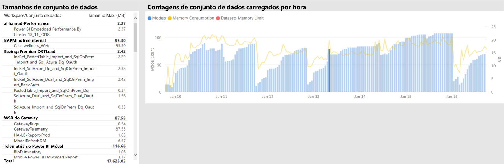

O administrador do Power BI pode tentar resolver o problema executando as etapas para garantir que a memória suficiente está disponível para as atualizações de dados iniciar por:

- Entrando em contato com o conjunto de dados proprietários e solicitando a escalonar e os dados de espaço agendas de atualização
- Reduzindo o conjunto de dados de carga da consulta removendo painéis desnecessários ou painel blocos, especialmente aquelas que impor segurança em nível de linha
- Acelerando as atualizações de dados, otimizando a lógica do Power Query, modelo de colunas calculadas ou atualizar tabelas, reduzindo os tamanhos de conjunto de dados ou configurando a grandes conjuntos de dados para executar incremental de dados

### Identificando conjuntos de dados de resposta lenta

Nesse cenário, uma investigação foi disparada quando os usuários reclamam que certos relatórios demoravam muito tempo para abrir e às vezes poderia ser interrompido.

No aplicativo, o administrador do Power BI pode usar o **durações de consulta** visual para determinar os conjuntos de dados de pior desempenho por meio de conjuntos de dados de classificação decrescente **duração média**. Este visual também mostra dataset contagens de consulta, para que você possa ver a frequência com que os conjuntos de dados são consultados.

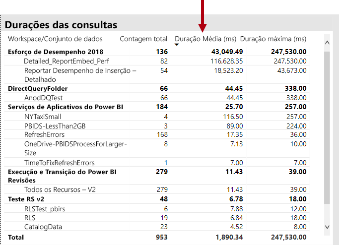

O administrador do Power BI pode se referir à **distribuição de duração da consulta** visual, que mostra uma distribuição geral de desempenho da consulta em bucket (< = 30ms, 0-100 ms, etc.) para o período de tempo filtrado. Em geral, as consultas que usam um segundo ou menos são consideradas responsiva pela maioria dos usuários; consultas que demoram mais tendem a criar uma percepção de mau desempenho.

O **distribuição de duração de consulta por hora** visual permite que o administrador do Power BI identificar períodos de uma hora quando o desempenho de capacidade poderia ter sido percebido como insatisfatórios. Quanto maior a barra de segmentos que consultam representam durações em um segundo, o maior o risco de que os usuários passarão a baixo desempenho.

O visual é interativo e quando um segmento da barra for selecionado, o correspondente **durações de consulta** visual na página do relatório de tabela é um filtro para mostrar os conjuntos de dados que ele representa. A filtragem cruzada permite ao administrador do Power BI identificar facilmente quais conjuntos de dados estão respondendo lentamente.

A imagem a seguir mostra um visual filtrado por **distribuições por hora de duração da consulta**, com foco nos conjuntos de dados pior desempenho nos buckets de uma hora. 

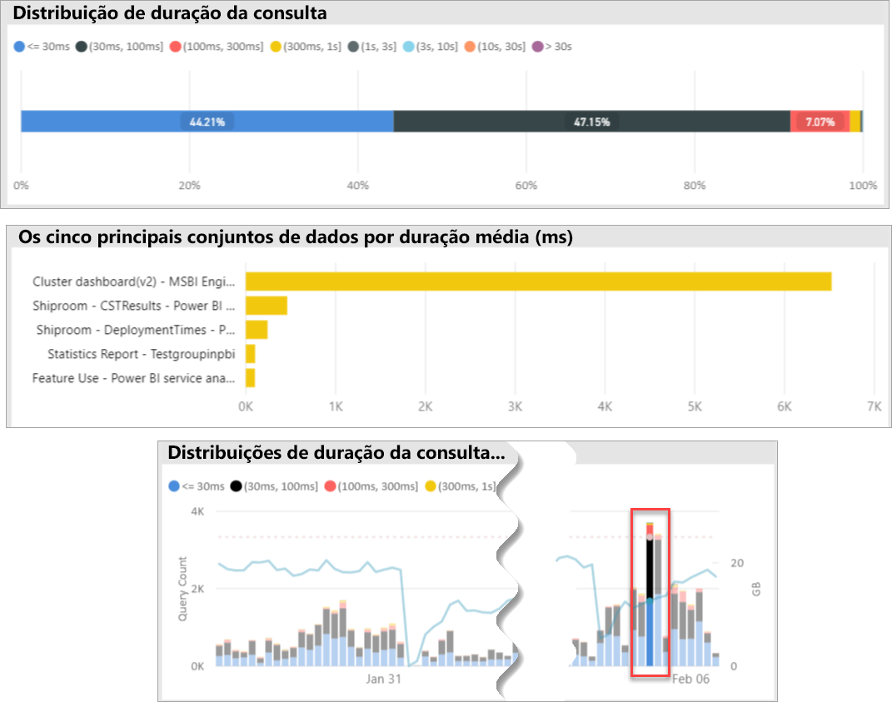

Depois que o conjunto de dados de desempenho ruim em um período de 1 hora específico for identificado, o administrador do Power BI pode investigar se um desempenho ruim é causado por uma capacidade sobrecarregada ou devido a um mal projetado o conjunto de dados ou relatório. Para fazer isso, eles podem consultar o **tempos de espera de consulta** visual e conjuntos de dados de classificação decrescente, de tempo de espera médio de consulta. Se um grande percentual das consultas estiver aguardando, uma alta demanda para o conjunto de dados provavelmente é a causa de muitas esperas de consulta. Se a consulta de média de tempo de espera é significativa (> 100 ms), que ele pode valer a pena examinar o conjunto de dados e o relatório para ver se as otimizações podem ser feitas. Por exemplo, talvez menos elementos visuais na considerando as páginas do relatório ou uma otimização de expressão DAX.

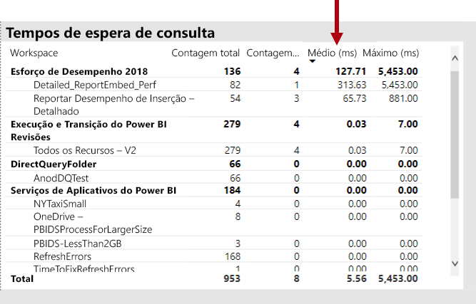

Há várias razões possíveis para compilação de tempo de espera consulta-se em conjuntos de dados:

- Um design de modelo abaixo do ideal, expressões de medida ou design de relatório até mesmo - todas as circunstâncias que podem contribuir para consultas que consomem altos níveis de CPU de longa execução. Isso força a novas consultas para aguardar até que os threads de CPU se tornarem disponíveis e podem criar um efeito de comboio (congestionamento no tráfego raciocínio), geralmente visto durante o horário comercial de pico. O **esperas de consulta** página poderá ser o principal recurso para determinar se os conjuntos de dados têm tempos de espera médio de consulta altas.
- Um grande número de usuários simultâneos de capacidade (centenas a milhares) consumindo o mesmo relatório ou conjunto de dados. Conjuntos de dados até mesmo bem projetados podem executar mal exceder um limite de simultaneidade. Isso geralmente é indicado por um único conjunto de dados mostrando um valor de drasticamente mais alto para a consulta a conta que mostrar outros conjuntos de dados (ou seja, de 300 mil consultas para um conjunto de dados em comparação com < 30 mil consultas para todos os outros conjuntos de dados). Em algum momento a consulta aguarda até que esse conjunto de dados será iniciado escalonar e isso será visto o **durações de consulta** visual.
- Muitos diferentes conjuntos de dados consultados ao mesmo tempo, causando ultrapaginação como conjuntos de dados com frequência ciclo dentro e fora de memória. Isso resulta em usuários que estão tendo lentidão no desempenho quando o conjunto de dados é carregado na memória. Para confirmar isso, o administrador do Power BI pode se referir a **remoções de conjunto de dados por hora e o consumo de memória** visual, que pode indicar que um grande número de conjuntos de dados carregados na memória está sendo removido repetidamente.

### Identificando as causas para lento-respondendo esporadicamente conjuntos de dados

Nesse cenário, uma investigação foi acionada quando usuários descrito relatórios visuais, às vezes, achamos lento para responder ou pode parar de responder, mas outras vezes foram aceitável responsivos.

Dentro do aplicativo, o **durações de consulta** seção foi usada para localizar o conjunto de dados culpado da seguinte maneira:

- No **durações de consulta** visual o administrador filtrado de conjunto de dados pelo conjunto de dados (começando às principais conjuntos de dados consultados) e examinado cruzadas filtradas barras o **distribuições por hora de consulta** visual.
- Quando uma única barra de uma hora mostrou alterações significativas na taxa entre todos os grupos de duração de consulta vs. outras barras de uma hora para esse conjunto de dados (ou seja, as taxas entre as cores altera drasticamente), isso significa que esse conjunto de dados demonstrou uma alteração de esporádica no desempenho.
- As barras de uma hora que mostra uma parte de irregular de baixo desempenho de consultas, indicado um intervalo de tempo em que esse conjunto de dados foi afetado por um efeito de vizinho barulhento, causado por atividades de outros conjuntos de dados.

A imagem abaixo mostra uma hora em 30 de janeiro, onde um obstáculo significativo no desempenho de um conjunto de dados ocorreu, indicado pelo tamanho do "(3,10s]"execução duração bucket. Clicando em uma hora barra revela uma todos os conjuntos de dados carregados na memória durante esse tempo, assim identificando os conjuntos de dados do candidato culpado fazendo com que o efeito de vizinho barulhento.

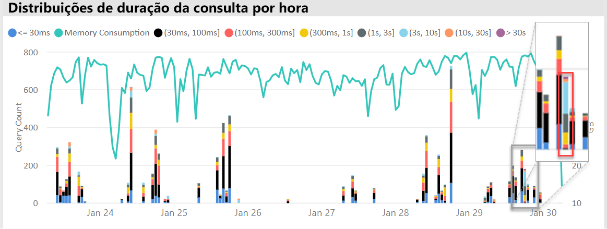

Depois de um timespan problemático for identificado (ou seja, durante o dia 30 de janeiro, na imagem acima) o administrador do Power BI pode remover todos os filtros de conjunto de dados e filtrar apenas por esse período de tempo para determinar quais conjuntos de dados foram consultados ativamente durante esse tempo. O conjunto de dados para o efeito de vizinho barulhento culpado é geralmente o conjunto de dados consultado superior ou aquela com a duração média de consulta mais longa.

Uma solução para esse problema pode ser distribuir o culpado conjuntos de dados em espaços de trabalho diferentes em diferentes capacidades Premium ou em capacidade compartilhada, se o tamanho do conjunto de dados, requisitos de consumo e atualização de dados padrões são suportados.

O inverso também poderia ser true. O administrador do Power BI pode identificar quando um conjunto de dados de desempenho de consulta melhora drasticamente e, em seguida, procure o que desapareceu. Se faltam determinadas informações naquele ponto, que pode ajudar para apontar para o causando problema.

### Determinando se há memória suficiente

Para determinar se há memória suficiente para a capacidade para concluir suas cargas de trabalho, o administrador do Power BI pode se referir à **percentuais de memória consumida** visual na **conjuntos de dados** guia do aplicativo. **Todos os** memória (total) representa a memória consumida por conjuntos de dados carregados na memória, independentemente se eles são consultados ou processados ativamente. **Active Directory** memória representa a memória consumida por conjuntos de dados que estão sendo processados ativamente.

Em uma capacidade íntegra visual se parecerá com este, mostrando uma lacuna entre todos os (total) e de memória ativa:

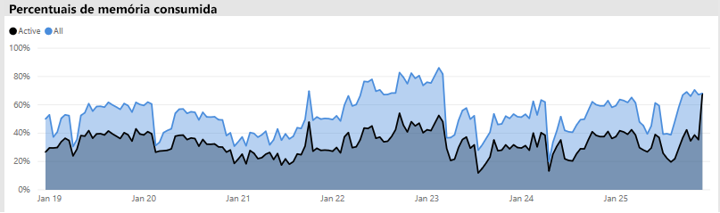

Em uma capacidade sofrendo a pressão de memória, o mesmo elemento visual claramente mostrará memória ativa e a memória total convergindo, o que significa que é impossível carregar conjuntos de dados adicionais na memória no momento. Nesse caso, o administrador do Power BI pode clicar **capacidade reinicie** (no **opções avançadas de** da área de configurações de capacidade do portal de administração). Reiniciando os resultados de capacidade em conjuntos de dados são liberadas da memória e permitindo que eles Recarregar na memória conforme necessário (por consultas ou atualização de dados).

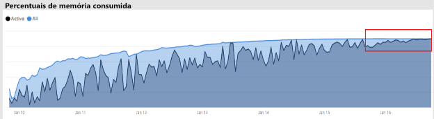

### Determinando se há suficiente de CPU

Em geral, utilização média da CPU de uma capacidade deve permanecer abaixo de 80%. Exceder esse valor significa que a capacidade está se aproximando da saturação da CPU.

Efeitos de saturação da CPU são expressos por operações demorando mais do que deveriam devido à capacidade de realizar muitas alternâncias de contexto de CPU, ele tenta processar todas as operações. Tempos de espera em uma capacidade Premium com um grande número de consultas simultâneas, que isso é indicado por consulta altas. Uma consequência de tempos de espera de consulta altas é a capacidade de resposta mais lenta que o normal. O administrador do Power BI pode identificar facilmente quando a CPU está saturada, por meio da exibição de **distribuições de tempo de espera por hora consulta** visual. Contagens de indicam possíveis saturação da CPU de tempo de espera de picos periódicos de consulta.

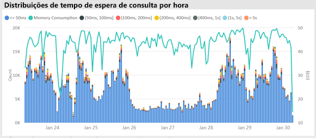

Um padrão semelhante, às vezes, pode ser detectado em operações em segundo plano se elas contribuem para a saturação da CPU. Um administrador do Power BI pode procurar um pico periódico em tempos de atualização para um conjunto de dados específico, o que pode indicar a saturação da CPU no momento (provavelmente devido a outras atualizações de conjunto de dados em andamento e/ou consultas interativas). Nessa instância, referindo-se para o **sistema** exibição no aplicativo pode não necessariamente revelar que a CPU está em 100%. O **sistema** modo de exibição exibe as médias de hora em hora, mas a CPU pode se tornar saturada por vários minutos de operações pesadas, que mostra como picos nos tempos de espera.

Há mais nuances para ver o efeito de saturação da CPU. Embora o número de consultas que aguardar seja importante, tempo de espera de consulta sempre acontecerá até certo ponto sem causar degradação de desempenho considerável. Alguns conjuntos de dados (com tempo de média de consulta mais longa, que indica a complexidade ou tamanho) são mais propensos aos efeitos de saturação da CPU que outras pessoas. Para identificar facilmente esses conjuntos de dados, o administrador do Power BI pode observar alterações na composição de cor das barras na **distribuição do tempo de espera por hora** visual. Depois de identificar uma barra de exceções, podem parecer para os conjuntos de dados que teve esperas de consulta durante esse período e examinar também o tempo de espera médio de consulta em comparação à média de duração da consulta. Quando essas duas métricas são da mesma magnitude e a carga de trabalho de consulta do conjunto de dados é não trivial, é provável que o conjunto de dados é afetado por CPU insuficiente.

Esse efeito pode ser especialmente aparente quando um conjunto de dados é consumido em curtos picos de consultas de alta frequência por vários usuários (ou seja, em uma sessão de treinamento), resultando em saturação da CPU durante cada disparo. Nesse caso, os tempos de espera de consulta significativas nesse conjunto de dados podem ser experimentados, bem como causar impacto em outros conjuntos de dados na capacidade (efeito de vizinho barulhento).

Em alguns casos, os administradores do Power BI podem solicitar que os proprietários de conjunto de dados criam uma menor carga de trabalho de consulta volátil, criando um painel (quais consultas periodicamente com qualquer conjunto de dados de atualização para blocos em cache), em vez de um relatório. Isso pode ajudar a evitar picos quando o painel for carregado. Essa solução talvez nem sempre seja possível para determinada requisitos de negócios, no entanto, ele pode ser uma maneira eficiente para evitar a saturação da CPU, sem fazer a alteração para o conjunto de dados.

## Conclusão

O Power BI Premium fornece desempenho mais consistente, suporte para grandes volumes de dados e a flexibilidade de uma plataforma unificada de BI de autoatendimento e do enterprise para todos em sua organização. Este white paper técnico de nível 300 foi escrito especificamente para administradores do Power BI e os autores de conteúdo e editores. Tem como objetivo ajudá-los a compreender o potencial do Power BI Premium e explicam como criar, implantar, monitorar e solucionar problemas de soluções escalonáveis.

Para implantar e gerenciar as capacidades do Power BI Premium, os administradores e desenvolvedores de modelo exige um bom entendimento de como função de capacidades, como eles podem ser gerenciados e monitorados e como modelos podem ser otimizados, para responder adequadamente a problemas de desempenho e gargalos que surgirem.

## Notas de fim

\[1\] neste artigo técnico está preocupado com o Power BI Premium, que só é compatível com o serviço de nuvem do Power BI e para que o servidor de relatório do Power BI é não está no escopo, exceto para o estado em que a licença necessária para instalar o servidor de relatório do Power BI é incluído com algumas SKUs do Power BI Premium.

\[2\] power BI como um serviço de nuvem quando usado para inserir conteúdo em nome dos usuários do aplicativo é a plataforma-como um serviço (PaaS). Esse tipo de inserção pode ser obtido com dois produtos diferentes, um dos quais é o Power BI Premium.

\[3\] enviar por push, streaming e conjuntos de dados híbrido não são armazenados em capacidades Premium e, portanto, não são considerados quando implantando, gerenciando e monitorando as capacidades Premium.

\[4\] pastas de trabalho do Excel como um tipo de conteúdo do Power BI não são armazenadas em capacidades Premium e, portanto, não são considerados durante a implantação, gerenciamento ou monitoramento capacidades Premium.

\[5\] visuais podem ser configurados para ignorar as interações de segmentação de dados. Para obter mais informações, consulte o [interações de visualização em um relatório do Power BI](service-reports-visual-interactions.md) documento.

\[6\] a diferença no tamanho pode ser determinada comparando o tamanho do arquivo do Power BI Desktop com o uso de memória o Gerenciador de tarefas para o arquivo.

\[7\] incluem de suporte para fontes de dados do Microsoft SQL Server, blocos de dados do Azure, Azure HDInsight Spark (Beta), banco de dados SQL e Azure SQL Data Warehouse. Para obter informações sobre as fontes adicionais, consulte o [fontes de dados compatíveis com consulta direta no Power BI](desktop-directquery-data-sources.md) documento.

\[8\] power BI Premium dá suporte ao carregamento de um arquivo do Power BI Desktop (. pbix) até um máximo de 10 GB de tamanho. Uma vez carregado, um conjunto de dados pode crescer até 12 GB de tamanho como resultado da atualização. Tamanho máximo do carregamento varia por SKU. Para obter mais informações, consulte o [suporte do Power BI Premium para grandes conjuntos de dados](service-premium-large-datasets.md) documento.

\[9\] SKUs com menos de quatro núcleos não são executados em uma infraestrutura dedicada. Isso inclui EM1, EM2, A1 e A2 SKUs.

\[10\] Embora seja raro, os modelos podem ser descarregados da memória devido a operações de serviço.

\[11\] esses intervalos estão sujeitos a alterações a qualquer momento.

\[12\] isso é conhecido como várias áreas geográficas, atualmente em versão prévia. A lógica para uma implantação de várias áreas geográficas é normalmente usada em corporativo ou conformidade do governo, em vez de desempenho e escala. Relatório e o carregamento do painel ainda envolve as solicitações para a região de residência de metadados. Para obter mais informações, consulte o [suporte de várias áreas geográficas para o Power BI Premium (versão prévia)](service-admin-premium-multi-geo.md) documento.

\[13\] , é possível que os usuários podem causar problemas de desempenho por sobrecarregar o serviço do Power BI com trabalhos, escrever consultas excessivamente complexas, criação de referências circulares, etc.

\[14\] a opção de atribuir espaços de trabalho de toda a organização não é recomendada e uma abordagem mais direcionada é preferencial. Em geral, não é prática recomendada usar espaços de trabalho pessoas para o conteúdo de produção.

\[15\] é possível monitorar os SKUs a no aplicativo ou no portal do Azure, mas não no Portal de administração do Power BI. Para monitorar os SKUs a, a atualização do relatório falhará se o aplicativo não tiver sido adicionado à função Leitor do recurso. Para obter mais informações, consulte o [as capacidades de Monitor de Power BI Premium e o Power BI Embedded](service-admin-premium-monitor-capacity.md) documento.

\[16\] atualizações podem esperar quando não há CPU ou memória suficiente para iniciar.

\[17\] o tamanho do conjunto de dados na memória pode ser maior que o tamanho em disco por até 20%.

\[18\] média de uso de memória (GB) e o mais alto consumo de memória (GB)

\[19\] remoções de conjunto de dados

\[20\] consultas de conjunto de dados, duração da consulta de conjunto de dados média (ms), conjunto de dados aguarde contagem e o tempo de espera médio do conjunto de dados (ms)

\[21\] alta contagem de utilização da CPU e tempo de CPU de utilização mais alta (últimos sete dias)

\[22\] DQ/LC alta contagem de utilização e a hora DQ/LC da maior utilização (últimos sete dias)