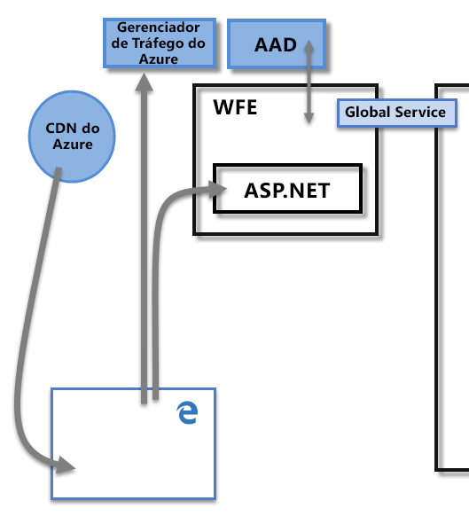
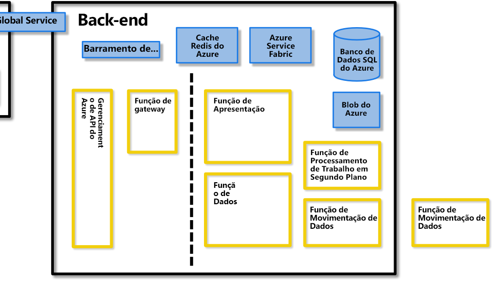
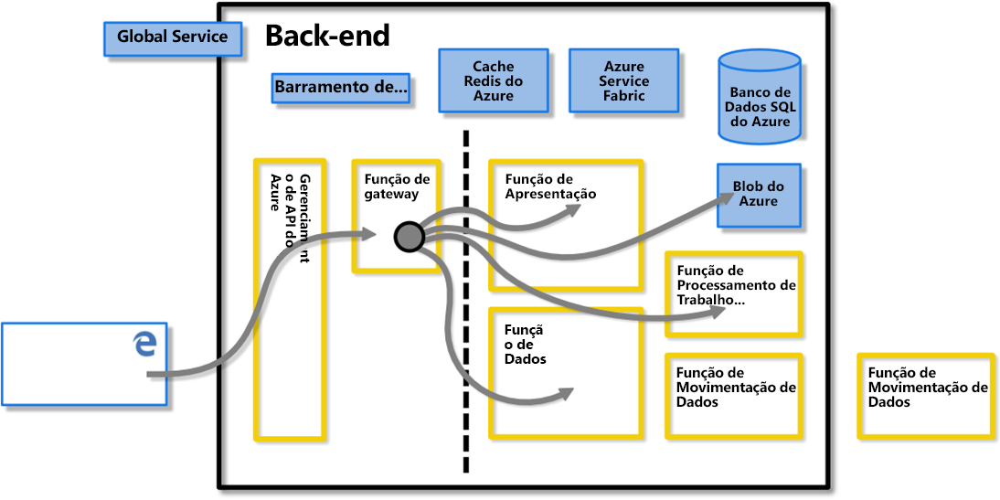
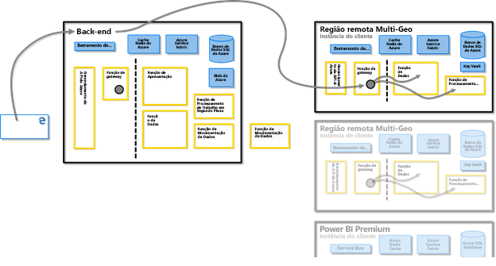
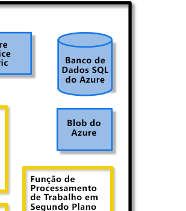
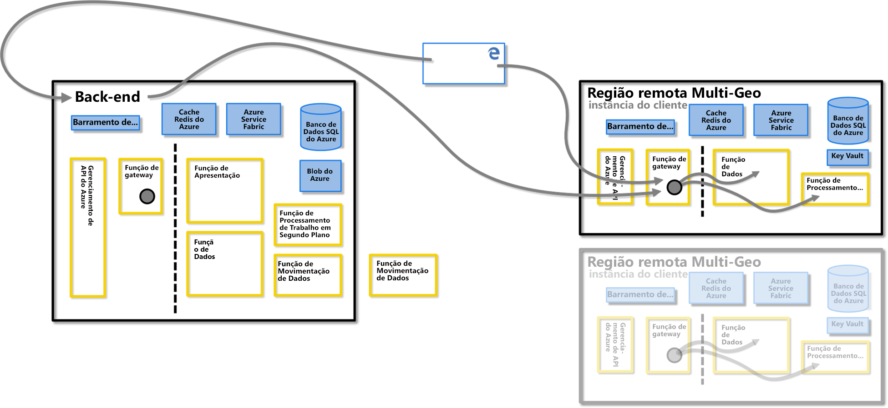
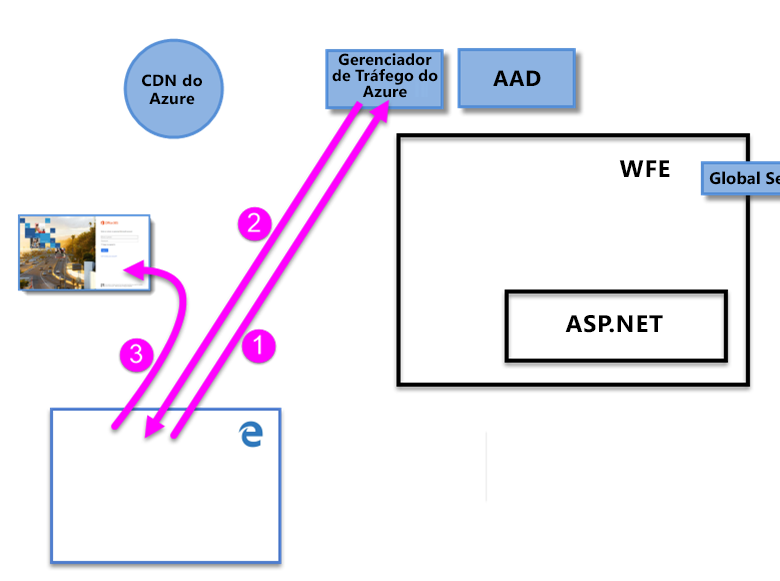
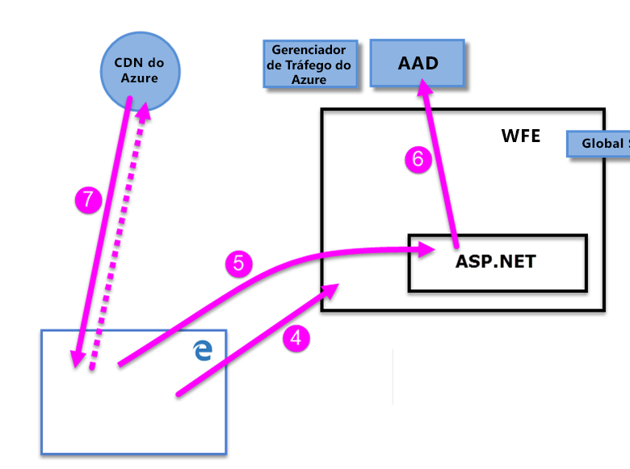

# White paper de segurança do Power BI

**Resumo:** O Power BI é uma oferta de serviço de software online (*SaaS*, ou Software como serviço) da Microsoft que permite que você crie de modo rápido e fácil dashboards, relatórios, conjuntos de dados e visualizações de Business Intelligence de autoatendimento. Com o Power BI, você pode se conectar a várias fontes de dados diferentes, combinar e moldar os dados usando essas conexões e criar relatórios e dashboards que podem ser compartilhados com outras pessoas.

**Escritor:** Donato Dias

**Revisores técnicos:** Pedram Rezaei, Cristian Petculescu, Siva Harinath, Tod Manning, Haydn Richardson, Adam Wilson, Ben Childs, Robert Bruckner, Sergei Gundorov, Kasper de Jonge

**Aplica-se a:** Power BI SaaS, Power BI Desktop, Power BI Embedded, Power BI Premium

> [!NOTE]
> Você pode salvar ou imprimir este whitepaper selecionando **Imprimir** no seu navegador e, em seguida, selecionando **Salvar como PDF**.

## Introdução

O **Power BI** é uma oferta de serviço de software online (_SaaS_, ou Software como serviço) da Microsoft que permite que você crie de modo rápido e fácil dashboards, relatórios, conjuntos de dados e visualizações de Business Intelligence de autoatendimento. Com o Power BI, você pode se conectar a várias fontes de dados diferentes, combinar e moldar os dados usando essas conexões e criar relatórios e dashboards que podem ser compartilhados com outras pessoas.

O serviço do Power BI é regido pelos [Termos de Serviços Online da Microsoft](http://www.microsoftvolumelicensing.com/DocumentSearch.aspx?Mode=3&amp;DocumentTypeId=31) e a [Política de Privacidade do Microsoft Enterprise](http://www.microsoft.com/privacystatement/OnlineServices/Default.aspx). Para o local de processamento de dados, consulte os termos de Local de Processamento de Dados nos Termos de Serviços Online da Microsoft. Para obter informações de conformidade, o [Microsoft Trust Center](https://www.microsoft.com/trustcenter) é o principal recurso para o Power BI. A equipe do Power BI está trabalhando duro para trazer a seus clientes as mais recentes inovações e produtividade. O Power BI está atualmente na Camada D da [Estrutura de Conformidade do Office 365](http://go.microsoft.com/fwlink/p/?LinkID=618494).

Este artigo descreve a segurança do Power BI dando uma explicação da arquitetura do Power BI, então explicando como os usuários são autenticados para o Power BI e as conexões de dados são estabelecidas e, por fim, descrevendo como o Power BI armazena e move os dados pelo serviço. A última seção é dedicada a perguntas relacionadas à segurança, sendo fornecidas respostas para cada uma.

## Arquitetura do Power BI

O serviço do **Power BI** se baseia no **Azure**, que é a [plataforma de computação em nuvem](http://azure.microsoft.com/overview/what-is-azure/) da Microsoft. O Power BI atualmente está implantado em muitos datacenters em todo o mundo – há muitas implantações ativas disponibilizadas para clientes nessas regiões atendidas por esses datacenters, e um número igual de implantações passivas que servem como backups para cada implantação ativa.

Cada implantação do Power BI consiste de dois clusters – um cluster da Web de Front-End (**WFE**) e um cluster de **Back-End**. Esses dois clusters são mostrados na imagem a seguir e fornece o pano de fundo para o restante deste artigo. 

O Power BI usa o AAD (**Azure Active Directory**) para autenticação e gerenciamento de conta. O Power BI também usa o ATM (**Gerenciador de Tráfego do Azure**) para direcionar o tráfego de usuário para o datacenter mais próximo, determinado pelo registro DNS do cliente buscando conectar-se, para o processo de autenticação e para baixar conteúdo estático e arquivos. O Power BI usa a CDN (**Rede de Distribuição de Conteúdo**) do Azure para distribuir de modo eficiente os arquivos e o conteúdo estático necessários aos usuários, com base na localidade geográfica.

### O Cluster WFE

O cluster **WFE** gerencia o processo de conexão e autenticação inicial para o Power BI, usando AAD para autenticar clientes e fornecer tokens para conexões de cliente subsequentes ao serviço do Power BI.

Quando os usuários tentam se conectar ao serviço do Power BI, o serviço DNS do cliente pode se comunicar com o **Gerenciador de Tráfego do Azure** para localizar o datacenter mais próximo com uma implantação do Power BI. Para obter mais informações sobre esse processo, veja [Método de roteamento de tráfego de desempenho para o Gerenciador de Tráfego do Azure](https://azure.microsoft.com/documentation/articles/traffic-manager-routing-methods/#performance-traffic-routing-method).

O cluster WFE mais próximo do usuário gerencia a sequência de logon e autenticação (descrito mais adiante neste artigo) e fornecerá um token do AAD para o usuário depois que a autenticação for bem-sucedida. O componente do ASP.NET dentro do cluster WFE analisa a solicitação para determinar a qual organização o usuário pertence e, em seguida, consulta o **Serviço Global** do Power BI. O Serviço Global é uma Tabela do Azure única compartilhada entre todos os clusters de Back-End e WFE mundiais que mapeia organizações de usuários e clientes para o datacenter que aloja o locatário do Power BI. O WFE especifica para o navegador qual cluster de Back-End hospeda o locatário da organização. Quando um usuário é autenticado, as interações subsequentes do cliente ocorrem com o cluster de Back-End diretamente, sem que o WFE seja um intermediador para essas solicitações.

### O Cluster de Back-End do Power BI

O cluster de **Back-End** é como os clientes autenticados interagem com o serviço do Power BI. O cluster de **Back-End** gerencia visualizações, painéis do usuário, conjuntos de dados, relatórios, armazenamento de dados, conexões de dados, a atualização de dados e outros aspectos de interação com o serviço do Power BI.

A **Função do Gateway** age como um gateway entre solicitações do usuário e o serviço do Power BI. Os usuários não interagem diretamente com nenhuma função, exceto a Função do Gateway.

**Importante:** É fundamental observar que _somente_ as funções de **APIM** (Gerenciamento de API do Azure) e **GW** (Gateway) podem ser acessadas pela Internet pública. Elas fornecem autenticação, autorização, proteção DDoS, Limitação, Balanceamento de Carga, Roteamento e outros recursos.

A linha pontilhada na imagem do cluster de **Back-End**, representada acima, esclarece o limite entre apenas duas funções que podem ser acessadas por usuários (à esquerda da linha pontilhada) e funções que só podem ser acessadas pelo sistema. Quando um usuário autenticado se conecta ao Serviço do Power BI a conexão, assim como qualquer solicitação feita pelo cliente, é aceita e gerenciada pela **Função do Gateway** e pelo **Gerenciamento de API do Azure**, que então interage em nome do usuário com o restante do Serviço do Power BI. Por exemplo, quando um cliente tenta exibir um painel, a **Função do Gateway** aceita a solicitação e envia separadamente uma solicitação para a **Função de Apresentação** para recuperar os dados necessários para que o navegador renderize o painel.

### Power BI Premium

O **Power BI Premium** oferece um workspace de serviço dedicado, provisionado e particionado para assinantes que precisam de recursos dedicados para suas atividades do Power BI. Quando um cliente se inscreve para uma assinatura do Power BI Premium, a capacidade Premium é criada por meio do **Azure Resource Manager**. A distribuição dessa assinatura atribui um conjunto de máquinas virtuais proporcionais ao nível de assinatura, no datacenter em que seu locatário do Power BI está hospedado (com exceção de várias áreas geográficas ambientes, conforme descrito posteriormente neste documento), começando como uma implantação do **Azure Service Fabric**.

Depois de criada, toda a comunicação com o cluster Premium é roteada por meio do cluster de Back-End do Power BI, em que uma conexão com as máquinas virtuais de assinatura do **Power BI Premium** dedicadas do cliente é estabelecida.

### Arquitetura de armazenamento de dados

O Power BI usa dois repositórios primários para armazenar e gerenciar dados: os dados carregados por usuários são enviados normalmente ao armazenamento de **Blobs do Azure**, enquanto todos os metadados e também os artefatos para o sistema em si são armazenados protegidos por um firewall no **Banco de Dados SQL do Azure**.

Por exemplo, quando um usuário importa uma pasta de trabalho do Excel para o serviço do Power BI, um banco de dados tabular na memória do Analysis Services é criado e os dados são armazenados na memória por até uma hora (ou até ocorrer pressão de memória do sistema). Os dados também são enviados ao armazenamento de **Blobs do Azure**.

Metadados sobre a assinatura do Power BI de um usuário, como dashboards, relatórios, fontes de dados recentes, workspaces, informações organizacionais, informações de locatário e outros metadados sobre o sistema são armazenados e atualizados no **Banco de Dados SQL do Azure**. Todas as informações armazenadas no Banco de Dados SQL do Azure são totalmente criptografadas usando a tecnologia TDE ([Transparent Data Encryption) do SQL Azure](https://msdn.microsoft.com/library/dn948096.aspx). Todos os dados armazenados no armazenamento de Blobs do Azure também são criptografados. Obter mais informações sobre o processo de carregamento, armazenamento e movimentação de dados são apresentadas na seção **Armazenamento e Movimentação de Dados**.

## Criação de locatário

Um locatário é uma instância dedicada do serviço do Azure AD que uma organização recebe e detém quando se inscreve em um serviço de nuvem da Microsoft, como o Azure, Microsoft Intune, Power BI ou Office 365. Cada locatário do Azure AD é diferente e separado de outros locatários do Azure AD.

Um locatário aloja os usuários em uma empresa e as informações sobre eles – suas senhas, dados de perfil do usuário, permissões e assim por diante. Ele também contém grupos, aplicativos e outras informações referentes a uma organização e sua segurança. Para obter mais informações, veja [O que é um locatário do Azure AD](https://msdn.microsoft.com/library/azure/jj573650.aspx#BKMK_WhatIsAnAzureADTenant).

Um locatário do Power BI é criado no datacenter considerado mais próximo das informações de país (ou região) e Estado fornecidas para o locatário no Azure Active Directory que foram fornecidas quando o serviço do Office 365 ou do Power BI foi inicialmente provisionado. O locatário do Power BI não se move desse local de datacenter atualmente.

### Múltiplas Áreas Geográficas (Multigeo) – Versão Prévia

Algumas organizações exigem uma presença do Power BI em várias áreas geográficas, ou regiões, com base nas necessidades de negócios. Por exemplo, uma empresa pode ter seu locatário do Power BI nos Estados Unidos, mas pode também fazer negócios em outras áreas geográficas, como Austrália, e precisar que os serviços e os dados do Power BI permaneçam nessa região remota.  A partir do segundo semestre de 2018, organizações com seu locatário em uma geografia também podem acessar recursos do Power BI em outra geografia quando provisionados corretamente. Esse recurso é conhecido como **múltiplas áreas geográficas** para conveniência e referência ao longo deste documento.

É preciso ter em mente algumas implicações técnicas ao operar em regiões diferentes, que são esclarecidas ao longo deste documento. Considerações importantes incluem as seguintes:

- Uma consulta em cache armazenada em uma região remota permanecerá naquela região em repouso, no entanto, outros dados em trânsito poderão ir e vir entre várias regiões geográficas.
- Relatórios em arquivos PBIX ou XLSX em uma região remota publicados no Power BI às vezes resultam em armazenar uma cópia ou cópia de sombra no armazenamento de Blobs do Azure do Power BI. Quando isso acontece, os dados são criptografados usando SSE (Criptografia do Serviço de Armazenamento) do Azure.
- Ao mover dados de uma região para outra em um ambiente de várias áreas geográficas, a coleta de lixo na região da qual os dados foram movidos ocorre dentro de 7 a 10 dias, ponto em que a cópia dos dados movidos de região original é destruída.

A imagem a seguir ilustra como os serviços do Power BI fornecidos na região remota com um ambiente de múltiplas áreas geográficas são roteados por meio do cluster de **Back-End do Power BI**, em que é estabelecida uma conexão com a máquina virtual de assinatura do Power BI remota do cliente.

### Data centers e localidades

O Power BI é oferecido em determinadas regiões com base em no local em que os clusters de Power BI estão implantados em data centers regionais. A Microsoft planeja expandir sua infraestrutura do Power BI para datacenters adicionais.

Os links a seguir fornecem informações adicionais sobre datacenters do Azure.

- [Regiões do Azure](http://azure.microsoft.com/regions/) – informações sobre os locais e a presença global do Azure
- [Serviços do Azure, por região](http://azure.microsoft.com/regions/#services) – uma listagem completa dos serviços do Azure (serviços de infraestrutura e serviços de plataforma) disponíveis na Microsoft em cada região.

Atualmente, o serviço do Power BI está disponível nas seguintes regiões atendidas pelos datacenters primários a seguir:

- Estados Unidos
  - Leste dos EUA
  - Leste dos EUA 2
  - Centro-Norte dos EUA
  - Centro-Sul dos EUA
  - Oeste dos EUA
  - Oeste dos EUA 2
- Canadá
  - Canadá Central
  - Leste do Canadá
- Reino Unido
  - Oeste do Reino Unido
  - Sul do Reino Unido
- Brasil
  - Sul do Brasil
- Alemanha
  - Alemanha Central
  - Nordeste da Alemanha
- Europa
  - Europa Setentrional
  - Europa Ocidental
- Japão
  - Leste do Japão
  - Oeste do Japão
- Índia
  - Índia Central
  - Sul da Índia
  - Índia Ocidental
- Pacífico Asiático
  - Ásia Oriental
  - Sudeste da Ásia
- Austrália
  - Leste da Austrália
  - Sudeste da Austrália

A Microsoft também fornece os datacenters para soberanias. Para obter mais informações sobre a disponibilidade de serviço do Power BI para nuvens soberanas, veja [Nuvens soberanas do Power BI](https://powerbi.microsoft.com/clouds/).

Para obter mais informações sobre o local em que seus dados serão armazenados e como serão usados, veja [Microsoft Trust Center](https://www.microsoft.com/TrustCenter/Transparency/default.aspx#_You_know_where). Compromissos sobre o local dos dados em repouso do cliente são especificados nos **Termos de Processamento de Dados** dos [Termos do Microsoft Online Services](http://www.microsoftvolumelicensing.com/DocumentSearch.aspx?Mode=3&amp;DocumentTypeId=31).

## Autenticação de Usuário

A autenticação do usuário para o serviço do Power BI consiste em uma série de solicitações, respostas e redirecionamentos entre o navegador do usuário e o serviço do Power BI ou os serviços do Azure usados pelo Power BI. Essa sequência descreve o processo de autenticação de usuário no Power BI. Para obter mais informações sobre as opções para modelos de autenticação de usuário da organização (modelos de entrada), veja [Escolhendo um modelo de entrada para o Office 365](https://blogs.office.com/2014/05/13/choosing-a-sign-in-model-for-office-365/).

### Sequência de autenticação

A sequência de autenticação de usuário para o serviço do Power BI ocorre conforme descrito nas próximas etapas, que são ilustradas nas imagens a seguir.

1. Um usuário inicia uma conexão ao serviço do Power BI de um navegador digitando o endereço do Power BI na barra de endereços (como https://app.powerbi.com) ou selecionando _Entrar_ da página de aterrissagem do Power BI https://powerbi.microsoft.com)). A conexão é estabelecida usando HTTPS e TLS 1.2, e todas as comunicações subsequentes entre o navegador e o serviço do Power BI usam HTTPS. A solicitação é enviada para o **Gerenciador de Tráfego do Azure**.

2. O **Gerenciador de Tráfego do Azure** verifica o registro DNS do usuário para determinar o datacenter mais próximo em que o Power BI é implantado e responde ao DNS com o endereço IP do WFE do cluster para o qual o usuário deve ser enviado.

3. O WFE então redireciona o usuário para a página de logon do Microsoft Online Services.

    

1. Quando o usuário é autenticado, a página de logon redireciona o usuário para o **cluster WFE** do serviço do Power BI mais próximo determinado anteriormente.

2. O navegador envia um cookie que foi obtido com o logon bem-sucedido para o Microsoft Online Services, que é inspecionado pelo **serviço ASP.NET** dentro do **cluster do WFE**.

3. O cluster do WFE comunica-se com o serviço **AAD** (**Azure Active Directory** ) para autenticar a assinatura de serviço do Power BI do usuário e obter um token de segurança do AAD. Quando o AAD retorna uma autenticação bem-sucedida do usuário e retorna um token de segurança do AAD, o cluster WFE consulta o **Power BI***Serviço Global**, que mantém uma lista de locatários e seus locais de cluster do Back-End do Power BI e determina qual cluster do serviço do Power BI contém o locatário do usuário. O cluster WFE então direciona o usuário para o cluster do Power BI, em que seu locatário reside e retorna uma coleção de itens para o navegador do usuário:

      - O **token de segurança do AAD**
      - **Informações da sessão**
      - O endereço Web do cluster de **Back-End** com o qual o usuário pode se comunicar e interagir

1. O navegador do usuário então contata a CDN do Azure especificada ou, para alguns dos arquivos, o WFE, para baixar a coleção de arquivos comuns especificados necessários para habilitar a interação do navegador com o serviço do Power BI. A página do navegador então inclui o token do AAD, as informações de sessão, o local do cluster de Back-End associado e a coleção de arquivos baixados da CDN do Azure e do cluster WFE pela duração da sessão do navegador de serviço do Power BI.

Depois que esses itens forem concluídos, o navegador iniciará o contato com o cluster de Back-End especificado e começará a interação do usuário com o serviço do Power BI. Desse ponto em diante, todas as chamadas ao serviço do Power BI são com o cluster de Back-End especificado e todas as chamadas incluem o token do AAD do usuário. O token do AAD tem um tempo limite de uma hora; para preservar o acesso, o WFE atualiza periodicamente o token se uma sessão do usuário permanece aberta.

## Movimentação e armazenamento de dados

No serviço do Power BI, os dados estão _em repouso_ (dados disponíveis para um usuário do Power BI que não estão sendo usados no momento) ou _em processo_ (por exemplo: consultas que estão sendo executadas, modelos e conexões de dados que estão sendo usados, dados e/ou modelos que estão sendo carregados para o serviço do Power BI e outras ações que os usuários ou o serviço do Power BI podem realizar com relação aos dados que está sendo acessados ou atualizados ativamente). Dados que estão em processo são conhecidos como _dados em processo_. Dados em repouso no Power BI são criptografados. Dados em trânsito, ou seja, dados que estão sendo enviados ou recebidos pelo serviço do Power BI, também são criptografados.

O serviço do Power BI também gerencia dados de maneira diferente com base em se os dados são acessados com uma **DirectQuery** ou _não_ são acessados com uma DirectQuery. Portanto, há duas categorias de dados de usuário para o Power BI: dados acessados por DirectQuery e dados não são acessados por DirectQuery.

Uma **DirectQuery** é uma consulta para a qual uma consulta de usuário do Power BI foi traduzida da linguagem DAX (Expressão de Análise de Dados) da Microsoft – que é a linguagem usada pelo Power BI e outros produtos da Microsoft para criar consultas – para a linguagem de dados nativa da fonte de dados (como T-SQL ou outras linguagens de banco de dados nativas). Os dados associados a uma DirectQuery são armazenados por referência, o que significa que os dados de origem não são armazenados no Power BI quando DirectQuery não está ativa (exceto para dados de visualização usados para exibir dashboards e relatórios, conforme descrito na seção _Dados em o processo [movimentação de dados]_ abaixo). Em vez disso, são armazenadas referências aos dados de DirectQuery que permitem o acesso aos dados quando a DirectQuery é executada. Um DirectQuery contém todas as informações necessárias para executar a consulta, incluindo a cadeia de conexão e as credenciais usadas para acessar as fontes de dados, o que permite que a DirectQuery conecte-se a fontes de dados incluídas para atualização automática. Com uma DirectQuery, as informações de modelo de dados de base são incorporadas da DirectQuery.

Uma consulta que **não** usa DirectQuery consiste em uma coleção de consultas DAX que _não_ são traduzidas diretamente para a linguagem nativa de nenhuma fonte de dados subjacente. Consultas que não são DirectQuery não incluem as credenciais para os dados subjacentes, e os dados subjacentes são carregados no serviço do Power BI, a menos que sejam dados locais acessados por meio de um [Power BI Gateway](https://powerbi.microsoft.com/documentation/powerbi-gateway-enterprise/), caso em que a consulta apenas armazena as referências a dados locais.

A distinção entre uma DirectQuery e outras consultas determina como o serviço do Power BI trata os dados em repouso e se a consulta em si é criptografada. As seções a seguir descrevem dados em repouso e em movimento e explicam a criptografia, o local e o processo de manipulação de dados.

### Dados em repouso

Quando os dados estão em repouso, o serviço do Power BI armazena conjuntos de dados, relatórios e blocos de dashboard da maneira descrita nas subseções a seguir. Como mencionado anteriormente, os dados em repouso no Power BI são criptografados. ETL significa Extração, Transformação e Carregamento nas seções a seguir.

#### Chaves de criptografia

- As chaves de criptografia para as chaves de Blobs do Azure são armazenadas criptografadas no Azure Key Vault.
- As chaves de criptografia para a tecnologia TDE do Banco de Dados SQL do Azure são gerenciadas pelo SQL do Azure em si.
- As chaves de criptografia para o gateway de dados local e o serviço de Movimentação de Dados são armazenadas:
  - No gateway de dados local na infraestrutura do cliente – para fontes de dados locais
  - Na Função de Movimentação de Dados – para fontes de dados baseadas em nuvem

A CEK (Chave de Criptografia de Conteúdo) usada para criptografar o armazenamento de Blobs do Microsoft Azure é uma chave de 256 bits gerada aleatoriamente. O algoritmo que a CEK usa para criptografar o conteúdo é AES\_CBC\_256.

A KEK (Chave de Criptografia de Chave) usada para criptografar a CEK é uma chave de 256 bits predefinida. O algoritmo por KEK para criptografar a CEK é A256KW.

As chaves de criptografia de gateway com base na chave de recuperação nunca saem de uma infraestrutura local. O Power BI não pode acessar os valores de credenciais criptografadas localmente e não pode interceptar essas credenciais; clientes Web criptografam a credencial com uma chave pública associada ao gateway específico com o qual está se comunicando.

Para fontes de dados baseadas em nuvem, a Função de Movimentação de Dados criptografa as chaves de criptografia usando métodos [Always Encrypted](https://msdn.microsoft.com/library/mt163865.aspx). Você pode aprender mais sobre o [recurso de banco de dados Always Encrypted](https://msdn.microsoft.com/library/mt163865.aspx).

#### Conjuntos de dados

1. Metadados (tabelas, colunas, medidas, cálculos, cadeias de conexão etc.)
      
    a. Para Analysis Services local, nada é armazenado no serviço, exceto por para uma referência ao banco de dados armazenado criptografado no SQL Azure.
 
    b. Todos os outros metadados de ETL, DirectQuery e Dados de Push são criptografados e armazenados no armazenamento de Blobs do Azure.

1. Credenciais para fontes de dados originais
  
      a. Analysis Services local – nenhuma credencial é necessária e, portanto, nenhuma credencial é armazenada.

      b. DirectQuery – depende de o modelo ser criado no serviço diretamente, caso em que é armazenado na cadeia de conexão e criptografado no Blob do Azure, ou de ser importado do Power BI Desktop, caso em que as credenciais são armazenadas criptografadas no Banco de Dados SQL do Azure da movimentação de Dados. A chave de criptografia é armazenada no computador executando o Gateway na infraestrutura do cliente.

      c. Dados com push – não aplicáveis

      d. ETL

      - Para **Salesforce** ou **OneDrive** – os tokens de atualização são armazenados criptografadas no banco de dados SQL do Azure do serviço do Power BI.
      - Caso contrário:
        - Se o conjunto de dados for definido para a atualização, as credenciais serão armazenadas criptografadas no Banco de Dados SQL do Azure da Movimentação de Dados. A chave de criptografia é armazenada no computador executando o Gateway na infraestrutura do cliente.
        - Se o conjunto de dados não for definido para a atualização, não haverá nenhuma credencial armazenada para as fontes de dados

1. Dados

    a. Analysis Services local e DirectQuery – nada é armazenado no Serviço do Power BI.

    b. ETL – criptografado no armazenamento de Blobs do Azure, mas todos os dados atualmente no armazenamento de Blobs do Azure do serviço do Power BI usam [SSE (Criptografia do Serviço de Armazenamento) do Azure](https://docs.microsoft.com/azure/storage/common/storage-service-encryption), também conhecido como criptografia do lado do servidor. Múltiplas áreas geográficas usam também SSE.

    c. Dados de push v1 – armazenados criptografado no armazenamento de Blobs do Azure, mas todos os dados atualmente no armazenamento de Blobs do Azure do serviço do Power BI usam [SSE (Criptografia do Serviço de Armazenamento) do Azure](https://docs.microsoft.com/azure/storage/common/storage-service-encryption), também conhecido como criptografia do lado do servidor. Múltiplas áreas geográficas usam também SSE.

    d. Dados de push v2 – armazenado criptografados no Azure SQL.

O Power BI usa a abordagem de criptografia do lado do cliente, usando o modo CBC (encadeamento de bloco cifrado) com criptografia AES para criptografar seu armazenamento de Blobs do Azure. Você pode [aprender mais sobre criptografia do lado do cliente](https://azure.microsoft.com/documentation/articles/storage-client-side-encryption/).

O Power BI fornece monitoramento de integridade de dados das seguintes maneiras:

* Para dados em repouso no SQL Azure, o Power BI usa dbcc, TDE e soma de verificação de página constante como parte das ofertas nativas do SQL.

* Para dados em repouso no armazenamento de Blobs do Azure, o Power BI usa criptografia do lado do cliente e HTTPS para transferir dados para o armazenamento, o que inclui verificações de integridade durante a recuperação dos dados. Você pode [saber mais sobre a segurança do armazenamento de Blobs do Azure](https://azure.microsoft.com/documentation/articles/storage-security-guide/).

#### Relatórios

1. Metadados (definição de relatório)

   a. Os relatórios podem estar em Excel para relatórios do Office 365 ou relatórios do Power BI. O seguinte se aplica a metadados com base no tipo de relatório:

       a. Excel Report metadata is stored encrypted in SQL Azure. Metadata is also stored in Office 365.
       
       b. Power BI reports are stored encrypted in Azure SQL database.

2. Dados estáticos

   Dados estáticos incluem artefatos, como imagens de segundo plano e elementos visuais personalizados.

    a. Para relatórios criados com o Excel para o Office 365, nada é armazenado.

    b. Relatórios do Power BI, os dados estáticos são armazenados e criptografados no armazenamento de Blobs do Azure.

3. Caches a. Para relatórios criados com o Excel para o Office 365, nada é armazenado em cache.

    b. Para relatórios do Power BI, dados para os elementos visuais mostrados são armazenados em cache criptografadas no Banco de Dados SQL do Azure.
 

4. Arquivos originais do Power BI Desktop (.pbix) ou do Excel (.xlsx) publicados no Power BI

    Às vezes, uma cópia ou cópia de sombra dos arquivos .xlsx ou .pbix é armazenada no armazenamento de Blobs do Azure do Power BI e, quando isso ocorre, os dados são criptografados. Todos esses relatórios armazenados no serviço do Power BI, no armazenamento de Blobs do Azure, usam [SSE (Criptografia do Serviço de Armazenamento) do Azure](https://docs.microsoft.com/azure/storage/common/storage-service-encryption), também conhecida como criptografia do lado do servidor. Múltiplas áreas geográficas usam também SSE.

#### Dashboards e blocos de dashboard

1. Caches – os dados necessários para os elementos visuais no dashboard normalmente são armazenado em cache e armazenados criptografado no Banco de Dados SQL do Azure. Outros blocos, como elementos visuais fixados do Excel ou do SSRS (SQL Server Reporting Services) são armazenados no Blob do Azure, como imagens, e também são criptografados.

2. Dados estáticos – incluem artefatos, como imagens de segundo plano e elementos visuais personalizados que são armazenados criptografados no armazenamento de Blobs do Azure.

Independentemente do método de criptografia usado, a Microsoft gerencia a criptografia de chave em nome dos clientes, em um repositório de segredos ou no Azure Key Vault.

### Dados armazenados temporariamente em dispositivos não voláteis

O exemplo a seguir descreve os dados armazenados temporariamente em dispositivos não voláteis.

#### Conjuntos de dados

1. Metadados (tabelas, colunas, medidas, cálculos, cadeias de conexão etc.)

2. Alguns artefatos relacionados a esquema podem ser armazenados no disco dos nós de computação por um período limitado. Alguns artefatos também podem ser armazenados no Cache REDIS do Azure não criptografado por um período limitado.

3. Credenciais para fontes de dados originais

    a. Analysis Services local – nada é armazenado

    b. DirectQuery – depende de o modelo ser criado no serviço diretamente, caso em que ele é armazenado na cadeia de conexão, em formato criptografado com a chave de criptografia armazenada em texto não criptografado no mesmo local (juntamente com as informações criptografadas), ou ser importado do Power BI Desktop, caso em que as credenciais não são armazenadas em dispositivos não voláteis.

    c. Dados enviados por push – nenhum (não aplicável)

    d. ETL – nenhum (nada é armazenado no nó de computação nem diferente do explicado na seção **Dados em Repouso** acima)
4. Dados

    Alguns artefatos de dados relacionados a esquema podem ser armazenados no disco dos nós de computação por um período limitado.

### Dados em processo

Os dados estão em processo quando estão sendo usados ou acessados ativamente por um usuário. Por exemplo, dados estão em processo quando um usuário acessa um conjunto de dados, revisa ou modifica um dashboard ou relatório, quando ocorre uma atualização ou outras atividades de acesso a dados que podem ocorrer. Quando qualquer um desses eventos ocorre e colocam os dados em processo, a **Função de Dados** no serviço do Power BI cria um banco de dados do AS (Analysis Services) em memória e o conjunto de dados é carregado para aquele banco de dados do Analysis Services na memória. Independentemente de o conjunto de dados ser baseado em um DirectQuery ou não, os dados carregados no banco de dados do AS não são criptografados para permitir o acesso pela **Função de Dados** e são mantidos na memória para acesso posterior, até que o serviço do Power BI não precise mais do conjunto de dados. Para clientes com uma assinatura do Power BI Premium, o Power BI cria um banco de dados do AS (Analysis Services) em memória na coleção de provisionada separadamente do cliente de máquinas virtuais do Power BI.

Depois que é realizada uma ação com relação aos dados, o que inclui o carregamento inicial dos dados para o Power BI, o serviço do Power BI pode armazenar em cache os dados de visualização em um **Banco de Dados SQL do Azure** criptografado independentemente de se o conjunto de dados ser baseado em uma DirectQuery.

Para monitorar a integridade dos dados para dados em processo, o Power BI usa HTTPS, TCP/IP e TLS para garantir que os dados sejam criptografados e mantenham a integridade durante o transporte.

## Autenticação do usuário para fontes de dados

Com cada fonte de dados, um usuário estabelece uma conexão com base em seu logon e acessa os dados com essas credenciais. Os usuários podem então criar consultas, dashboards e relatórios com base nos dados subjacentes.

Quando um usuário compartilha qualquer visualização, dashboards, relatório ou consulta, o acesso a esses dados e essas visualizações depende de se as fontes de dados subjacentes dão suporte à RLS (Segurança em Nível de Função).

Se uma fonte de dados subjacente tiver a capacidade para **RLS (Segurança em Nível de Função) do**** Power BI**, o serviço do Power BI aplicará essa segurança em nível de função, e os usuários que não tiverem credenciais suficientes para acessar os dados subjacentes (que poderiam ser uma consulta usada em um dashboard, relatório ou outro artefato de dados) não verão os dados para os quais eles não têm privilégios suficientes. Se o acesso de um usuário aos dados subjacentes for diferente do usuário que criou o dashboard ou relatório, as visualizações e outros artefatos somente mostrarão dados com base no nível de acesso que o usuário tem aos dados.

Se uma fonte de dados **não** aplicar RLS, as credenciais de logon do Power BI serão aplicadas à fonte de dados subjacente ou, caso outras credenciais sejam fornecidas durante a conexão, tais credenciais fornecidas serão aplicadas. Quando um usuário carrega dados no serviço do Power BI de fontes de dados não RLS, os dados são armazenados no Power BI conforme descrito na seção **Armazenamento e Movimentação de Dados** encontrada neste documento. Para fontes de dados não RLS, quando os dados são compartilhados com outros usuários (como por meio de um dashboard ou relatório) ou ocorre uma atualização de dados, as credenciais originais são usadas para acessar ou exibir os dados.

Para um exemplo rápido para comparar fontes de dados RLS e não RLS, imagine que Sam cria um relatório e um dashboard e compartilha-os com Abby e Ralph. Se as fontes usadas no relatório e no dashboard forem de dados de fontes de dados que **não** dão suporte a RLS, Abby e Ralph poderão ver os dados que Sam incluiu no dashboard (que foi carregado no serviço do Power BI) e tanto Abby quanto Ralph poderão interagir com os dados. Por outro lado, se Sam criar um relatório e um dashboard usando fontes de dados que deem suporte a RLS e, em seguida, compartilhar com Abby e Ralph, quando Abby tentar exibir o dashboard, o seguinte ocorrerá:

1. Como o dashboard é de uma fonte de dados RLS, as visualizações do dashboard brevemente mostrarão uma mensagem &quot;Carregando&quot; enquanto o serviço do Power BI consulta a fonte de dados para recuperar o conjunto de dados atual especificado na cadeia de conexão associada à consulta subjacente do dashboard.

2. Os dados são acessados e recuperados com base nas credenciais e na função de Abby, e apenas dados para os quais Abby tem autorização suficiente são carregados para o dashboard e o relatório.

3. As visualizações no dashboard e no relatório são exibidas com base no nível de função de Abby.

Se fosse Ralph fosse acessar o dashboard ou relatório compartilhado, a mesma sequência ocorria com base em seu nível de função.

## Power BI e ExpressRoute

Com o Power BI e o ExpressRoute, é possível criar uma conexão de rede privada de sua organização para o Power BI (ou usando as instalações de colocação de um ISP), ignorando a Internet para proteger melhor seus dados e conexões confidenciais do Power BI.

O ExpressRoute é um serviço do Azure que permite criar conexões privadas entre datacenters do Azure (nos quais o Power BI reside) e sua infraestrutura local ou criar conexões privadas entre datacenters do Azure e seu ambiente de colocação. Para obter mais informações, veja o artigo [Power BI e ExpressRoute](https://powerbi.microsoft.com/documentation/powerbi-admin-power-bi-expressroute/).

## Power BI Mobile

O Power BI Mobile é uma coleção de aplicativos projetados para as três plataformas móveis primárias: Android, iOS e Windows Mobile. Considerações de segurança para aplicativos do Power BI Mobile enquadram-se em duas categorias:

* Comunicação do dispositivo
* O aplicativo e os dados no dispositivo

Para **comunicação do dispositivo**, todos os aplicativos do Power BI Mobile comunicam-se com o serviço do Power BI e usam as mesmas sequências de conexão e autenticação usadas por navegadores, que são descritas detalhadamente no início deste white paper. Os aplicativos do Power BI Mobile para Android e iOS abrem uma sessão do navegador dentro do próprio aplicativo, e o aplicativo móvel do Windows abre um agente para estabelecer o canal de comunicação com o Power BI.

A tabela a seguir lista o suporte a CBA (autenticação baseada em certificado) para o Power BI Mobile com base na plataforma de dispositivo móvel:

| **Suporte a CBA** | **iOS** | **Android** | **Windows** |
| --- | --- | --- | --- |
| **Power BI** (entrar no serviço) | com suporte | com suporte | Não compatível |
| **SSRS ADFS** (conectar-se ao servidor do SSRS) | Não compatível | Compatível | Não compatível |

Aplicativos do Power BI Mobile ativamente comunicam-se com o serviço do Power BI. Telemetria é usada para coletar estatísticas de uso do aplicativo móvel e dados semelhantes, que são transmitidos para serviços usados para monitorar o uso e a atividade. Nenhuma PII (informações de identificação pessoal) é enviada com os dados de telemetria.

O **aplicativo no dispositivo** Power BI armazena dados no dispositivo que facilita o uso do aplicativo:

* Os tokens do Azure Active Directory e de atualização são armazenados em um mecanismo seguro no dispositivo usando medidas de segurança padrão do setor.

* Os dados são armazenados em cache no dispositivo, não sendo criptografados diretamente pelo próprio aplicativo

* As configurações também são armazenadas no dispositivo não criptografadas, mas nenhum dado de usuário real é armazenado.

O cache de dados do Power BI Mobile permanece no dispositivo por duas semanas ou até: o aplicativo ser removido; o usuário sair do Power BI Mobile; ou o usuário não conseguir entrar (como um evento de término do token ou alteração de senha). O cache de dados inclui dashboards e relatórios acessados anteriormente por meio do aplicativo Power BI Mobile.

Aplicativos do Power BI Mobile não veem pastas no dispositivo. Você pode [Saber mais sobre os dados offline em aplicativos do Power BI Mobile](https://powerbi.microsoft.com/documentation/powerbi-mobile-offline-android/).

Todas as três plataformas para as quais o Power BI Mobile está disponível têm suporte para o Microsoft Intune, um serviço de software que fornece gerenciamento de aplicativos e dispositivos móveis. Com o Intune habilitado e configurado, os dados no dispositivo móvel são criptografados e o próprio aplicativo do Power BI não pode ser instalado em um cartão SD. Você pode [Saber mais sobre o Microsoft Intune](http://www.microsoft.com/cloud-platform/microsoft-intune).

## Perguntas e respostas sobre segurança do Power BI

As perguntas a seguir são perguntas e respostas de segurança comuns para o Power BI. Elas são organizadas com base em quando foram adicionadas a este white paper para permitir que você localize rapidamente, com facilidade, novas perguntas e respostas quando este documento é atualizado. As perguntas mais recentes são adicionadas ao final dessa lista.

**Como os usuários se conectam e obtêm acesso a fontes de dados durante o uso do Power BI?**

* **Credenciais do Power BI e credenciais de domínio:** Os usuários fazem logon no Power BI usando um endereço de email; quando um usuário tenta se conectar a um recurso de dados, o Power BI passa o endereço de email de logon do Power BI como credenciais. Para recursos conectados ao domínio (locais ou baseados em nuvem), o email de logon é combinado com um _nome UPN_ ([UPN](https://msdn.microsoft.com/library/windows/desktop/aa380525(v=vs.85).aspx)) pelo serviço de diretório para determinar se há credenciais suficientes para permitir o acesso. Para organizações que usam endereços de email com base no trabalho para fazer logon no Power BI (o mesmo email que usam para fazer logon em recursos de trabalho, como _david@contoso.com_), o mapeamento pode ocorrer diretamente; para organizações que não usam endereços de email baseados no trabalho (como _david@contoso.onmicrosoft.com_), o mapeamento de diretório deve ser estabelecido para permitir o acesso a recursos locais com credenciais de logon do Power BI.

* **SQL Server Analysis Services e Power BI:** Para organizações que usam o SQL Server Analysis Services local, p Power BI oferece o gateway de dados local do Power BI (que é um **Gateway**, conforme mencionado nas seções anteriores).  O gateway de dados local do Power BI pode impor RLS (Segurança em Nível de Função) em fontes de dados. Para obter mais informações sobre RLS, veja **Autenticação do usuário para fontes de dados** anteriormente neste documento. Você também pode ler um artigo detalhado sobre o [Power BI Gateway](https://powerbi.microsoft.com/documentation/powerbi-gateway-enterprise/).

  Além disso, as organizações podem usar Kerberos para SSO (**logon único**) e conectar-se diretamente do Power BI a fontes de dados locais, como SQL Server, SAP HANA e Teradata. Para obter mais informações e os requisitos de configuração específicos, veja [**Usar Kerberos para SSO do Power BI para fontes de dados locais**](https://docs.microsoft.com/power-bi/service-gateway-kerberos-for-sso-pbi-to-on-premises-data).

* **Conexões fora de domínio**: Para conexões de dados que não são ingressadas no domínio e não têm a capacidade de RLS (Segurança em Nível de função), o usuário deve fornecer as credenciais durante a sequência de conexão, que o Power BI então passa para a fonte de dados para estabelecer a conexão. Se as permissões forem suficientes, os dados serão carregados da fonte de dados para o serviço do Power BI.

**Como os dados são transferidos para o Power BI?**

* Todos os dados solicitados e transmitidos pelo Power BI são criptografados em trânsito usando HTTPS para conectar-se da fonte de dados para o serviço do Power BI. Uma conexão segura é estabelecida com o provedor de dados, e somente depois disso os dados cruzam a rede.

**Como o Power BI armazena em cache dados de relatório, dashboard ou modelo, e isso é seguro?**

* Quando uma fonte de dados é acessada, o serviço do Power BI segue o processo descrito na seção **Armazenamento e movimentação de dados** no início deste documento.

**Clientes armazenam em cache de dados da página da Web localmente?**

* Quando os clientes do navegador acessam o Power BI, os servidores Web do Power BI definem a diretiva de _Cache-Control_ como _não armazenar_. A diretiva _não armazenar_ instrui os navegadores a não armazenar em cache a página da Web que está sendo visualizada pelo usuário e para não armazenar a página da Web na pasta de cache do cliente.

**E quanto à segurança baseada em função, o compartilhamento de relatórios ou dashboards e as conexões de dados? Como isso funciona em termos de acesso a dados, exibição de dashboard, acesso a relatório ou atualização?**

* Para fontes de dados não habilitadas para **RLS (Segurança em Nível de Função)**, se um dashboard, relatório ou modelo de dados for compartilhado com outros usuários por meio do Power BI, os dados então estarão disponíveis para usuários com os quais eles são compartilhados para exibição e interação. O Power BI *não* autentica novamente os usuários com relação à fonte original dos dados. Depois que os dados são carregados para o Power BI, o usuário autenticado em relação aos dados de origem é responsável por gerenciar que outros usuários e grupos podem ser exibir os dados.

  Quando as conexões de dados são feitas em uma fonte de dados com capacidade para **RLS**, como uma fonte de dados do Analysis Services, apenas dados do dashboard são armazenados em cache no Power BI. Sempre que é exibido ou acessado no Power BI um relatório ou conjunto de dados que usa dados da fonte de dados compatíveis com RLS, o serviço do Power BI acessa a fonte de dados para obter os dados com base nas credenciais do usuário e, se houver permissões suficientes, os dados serão carregados no relatório ou modelo de dados para esse usuário. Se a autenticação falhar, o usuário verá um erro.

  Para obter mais informações, veja a seção **Autenticação do usuário para fontes de dados** mais no início deste documento.

**Nossos usuários conectam-se à mesma fonte de dados o tempo todo, sendo que algumas delas requerem credenciais que diferem das credenciais de domínio. Como eles evitam precisar inserir essas credenciais sempre que fazem uma conexão de dados?**

* O Power BI oferece o [Power BI Personal Gateway](https://support.powerbi.com/knowledgebase/articles/649846), que é um recurso que permite aos usuários criar credenciais para várias fontes de dados diferentes e então automaticamente usá-las ao acessar depois cada uma dessas fontes de dados. Para obter mais informações, veja [Power BI Personal Gateway](https://support.powerbi.com/knowledgebase/articles/649846).

**Como funcionam os grupos do Power BI?**

* Grupos do Power BI permitem aos usuários colaborar de modo rápido e fácil com a criação de dashboards, relatórios e modelos de dados dentro de equipes estabelecidas. Por exemplo, se você tiver um grupo do Power BI que inclua cada pessoa em sua equipe imediata, poderá colaborar facilmente com todos em sua equipe selecionando o grupo do Power BI. Grupos do Power BI são equivalentes a Grupos Universais do Office 365 (sobre os quais você pode [saber mais](https://support.office.com/Article/Find-help-about-Groups-in-Office-365-7a9b321f-b76a-4d53-b98b-a2b0b7946de1), [criar](https://support.office.com/Article/View-create-and-delete-Groups-in-the-Office-365-admin-center-a6360120-2fc4-46af-b105-6a04dc5461c7) e [gerenciar](https://support.office.com/Article/Manage-Group-membership-in-the-Office-365-admin-center-e186d224-a324-4afa-8300-0e4fc0c3000a)) e usar os mesmos mecanismos de autenticação empregados no Azure Active Directory para proteger os dados. Você pode [criar grupos no Power BI](https://support.powerbi.com/knowledgebase/articles/654250) ou criar um Grupo Universal no centro de administração do Office 365; tem o mesmo resultado para a criação de grupo no Power BI.

  Observe que os dados compartilhados com grupos do Power BI seguem a mesma consideração de segurança que quaisquer dados compartilhados no Power BI. Para fontes de dados **não RLS**, o Power BI **não** autentica novamente os usuários com relação à fonte de dados original e, depois que os dados são carregados para o Power BI, o usuário autenticado em relação aos dados de origem é responsável por gerenciar que outros usuários e grupos podem ser exibir os dados. Para obter mais informações, veja a seção **Autenticação do usuário para fontes de dados** mais no início deste documento.

  Você pode obter mais informações sobre [Grupos no Power BI](https://support.powerbi.com/knowledgebase/articles/654247).

**Que portas são usadas pelo gateway de dados local e pelo gateway pessoal? Existem nomes de domínio que precisam ser permitidos para fins de conectividade?**

* A resposta detalhada para essa pergunta está disponível no seguinte link: [https://powerbi.microsoft.com/documentation/powerbi-gateway-enterprise](https://powerbi.microsoft.com/documentation/powerbi-gateway-enterprise)

**Ao trabalhar com o gateway de dados local, como as chaves de recuperação são usadas e em que local são armazenadas? E quanto ao gerenciamento de credenciais seguras?**

* Durante a configuração e a instalação do gateway, o administrador de digita **Chave de Recuperação** de um gateway. Essa **Chave de Recuperação** é usada para gerar os dois conjuntos de chaves muito mais fortes:

  - Uma chave assimétrica **RSA**
  - Uma chave assimétrica **AES**

  Essas chaves geradas (**RSA** e **AES**) são armazenadas em um arquivo localizado no computador local. Esse arquivo também é criptografado. O conteúdo do arquivo só pode ser descriptografado por aquele computador Windows em particular e somente por aquela conta de serviço de gateway específica.

  Quando um usuário insere credenciais da fonte de dados na interface do usuário do serviço do Power BI, as credenciais são criptografadas com a chave pública no navegador. O gateway criptografa novamente as credenciais (já criptografadas) com uma chave simétrica de AES antes que os dados sejam armazenados no Power BI. Com esse processo, o serviço do Power BI nunca tem acesso aos dados não criptografados.

**Quais protocolos de comunicação são usados pelo gateway de dados local e como eles são protegidos?**

* O gateway dá suporte aos dois seguintes protocolos de comunicação:

  - **AMQP 1.0 – TCP + TLS**: Esse protocolo exige que as portas 443, 5671 5672 e 9350 a 9354 estejam abertas para comunicação de saída. Esse protocolo é preferível, já que tem menor sobrecarga de comunicação.

  - **HTTPS – WebSockets por HTTPS + TLS**: Esse protocolo usa a porta 443 apenas. O WebSocket é iniciado por uma única mensagem HTTP CONNECT. Quando o canal é estabelecido, a comunicação é essencialmente TCP+TLS. Você pode forçar o gateway a usar esse protocolo modificando uma configuração descrita no [artigo de Gateway Local](https://powerbi.microsoft.com/documentation/powerbi-gateway-onprem/).

**Qual é a função da CDN do Azure no Power BI?**

* Conforme já mencionado, o Power BI usa a CDN (**Rede de Distribuição de Conteúdo**) do Azure para distribuir de modo eficiente os arquivos e o conteúdo estático necessários aos usuários, com base na localidade geográfica. Para entrar em mais detalhes, o serviço do Power BI usa várias **CDNs** para distribuir com eficiência os arquivos e o conteúdo estático necessários para aos usuários pela Internet pública. Esses arquivos estáticos incluem downloads de produtos (como **Power BI Desktop**, **gateway de dados local** ou aplicativos do Power BI de vários provedores de serviço independentes), arquivos de configuração do navegador usados para iniciar e estabelecer quaisquer conexões posteriores com o serviço do Power BI, bem como a página inicial segura de logon do Power BI.

  Com base nas informações fornecidas durante uma conexão inicial ao serviço do Power BI, o navegador do usuário entra em contato com a **CDN** do Azure especificada (ou para alguns arquivos, o **WFE**) para baixar a coleção de arquivos comuns especificados necessários para habilitar a interação do navegador com o serviço do Power BI. A página do navegador então inclui o token do AAD, as informações de sessão, o local do cluster de **Back-End** associado e a coleção de arquivos baixados da **CDN** do Azure e do cluster **WFE** pela duração da sessão do navegador de serviço do Power BI.

**Para visuais personalizados, a Microsoft executa alguma avaliação de segurança ou privacidade do código visual personalizado antes de publicar itens na Galeria?**

* Não. É responsabilidade do cliente examinar e determinar se código visual personalizado deve ser usado. Todo o código visual personalizado é operado em um ambiente de área restrita, de modo que qualquer código errôneo em um visual personalizado não afeta negativamente o restante do serviço do Power BI.

**Há outros visuais do Power BI que enviam informações fora da rede do cliente?**

* Sim. Bing Mapas e visuais ESRI transmitem dados fora do serviço do Power BI para visuais que usam esses serviços. Para obter mais informações e descrições detalhadas de tráfego do locatário de fora do Power BI, veja [**Power BI e ExpressRoute**](https://powerbi.microsoft.com/documentation/powerbi-admin-power-bi-expressroute/).

**E quanto à soberania de dados? Podemos provisionar locatários em data centers localizados em regiões geográficas específicas para garantir que dados não saiam das fronteiras do país?**

* Alguns clientes em determinadas regiões têm a opção de criar um locatário em uma nuvem soberana em que o armazenamento e o processamento de dados são mantidos separados de todos os outros datacenters. Nuvens soberanas têm um tipo de segurança um pouco diferente, uma vez que um objeto de confiança de dados separado opera o serviço do Power BI de nuvem soberana em nome da Microsoft.

  Como alternativa, os clientes também podem configurar um locatário em uma região específica, no entanto, esses locatários não têm um objeto de confiança de dados separado da Microsoft. O preço para nuvens soberanas é diferente do serviço do Power BI comercial disponível ao público geral. Para obter mais informações sobre a disponibilidade de serviço do Power BI para nuvens soberanas, veja [Nuvens soberanas do Power BI](https://powerbi.microsoft.com/clouds/).

**Como a Microsoft trata as conexões para os clientes que adquiriram assinaturas do Power BI Premium? Essas conexões são diferentes daquelas estabelecidas para o serviço não Premium Power BI?**

* As conexões estabelecidas para clientes com assinaturas do Power BI Premium implementam um processo de autorização [B2B (Business-to-Business) do Azure](https://docs.microsoft.com/azure/active-directory/active-directory-b2b-what-is-azure-ad-b2b) usando o Azure AD (Active Directory) para habilitar o controle de acesso e autorização. O Power BI lida com conexões de assinantes do Power BI Premium para recursos do Power BI Premium, assim como faria com qualquer outro usuário do Azure AD.

## Conclusão

A arquitetura do serviço do Power BI se baseia em dois clusters – o cluster da Web de Front-End (WFE) e o cluster de Back-End. O cluster WFE é responsável pela conexão inicial e autenticação do serviço do Power BI e, uma vez autenticado, o Back-End manipula todas as interações de usuário subsequentes. O Power BI usa o Azure Active Directory (AAD) para armazenar e gerenciar identidades de usuário e gerencia o armazenamento de dados e metadados pelo uso de Blob do Azure e Banco de Dados SQL do Azure, respectivamente.

O armazenamento e o processamento de dados no Power BI varia de acordo com o modo de acesso aos dados, usando uma DirectQuery ou não, e também depende de as fontes de dados estarem na nuvem ou serem locais. O Power BI também é capaz de impor RLS (Segurança em Nível de Linha) e interage com os Gateways que dão acesso a dados locais.

## Comentários e sugestões

Agradecemos seus comentários. Estamos interessados em ouvir sugestões para melhoria, adições ou esclarecimentos para este white paper ou outro conteúdo relacionado ao Power BI. Envie suas sugestões para [pbidocfeedback@microsoft.com](mailto:pbidocfeedback@microsoft.com).

## Recursos adicionais

Para obter informações adicionais sobre o Power BI, veja os seguintes recursos.

- [Grupos no Power BI](https://support.powerbi.com/knowledgebase/articles/654247)
- [Introdução ao Power BI Desktop](https://support.powerbi.com/knowledgebase/articles/471664)
- [Power BI Gateway](https://powerbi.microsoft.com/documentation/powerbi-gateway-enterprise/)
- [API REST do Power BI – Visão Geral](https://msdn.microsoft.com/library/dn877544.aspx)
- [Referência da API do Power BI](https://msdn.microsoft.com/library/mt147898.aspx)
- [Gateway de dados local](https://powerbi.microsoft.com/documentation/powerbi-gateway-onprem/)
- [Power BI e ExpressRoute](https://powerbi.microsoft.com/documentation/powerbi-admin-power-bi-expressroute/)
- [Nuvens Soberanas do Power BI](https://powerbi.microsoft.com/clouds/)
- [Power BI Premium](https://aka.ms/pbipremiumwhitepaper)
- [Use o Kerberos para SSO do Power BI para fontes de dados locais](https://docs.microsoft.com/power-bi/service-gateway-kerberos-for-sso-pbi-to-on-premises-data)